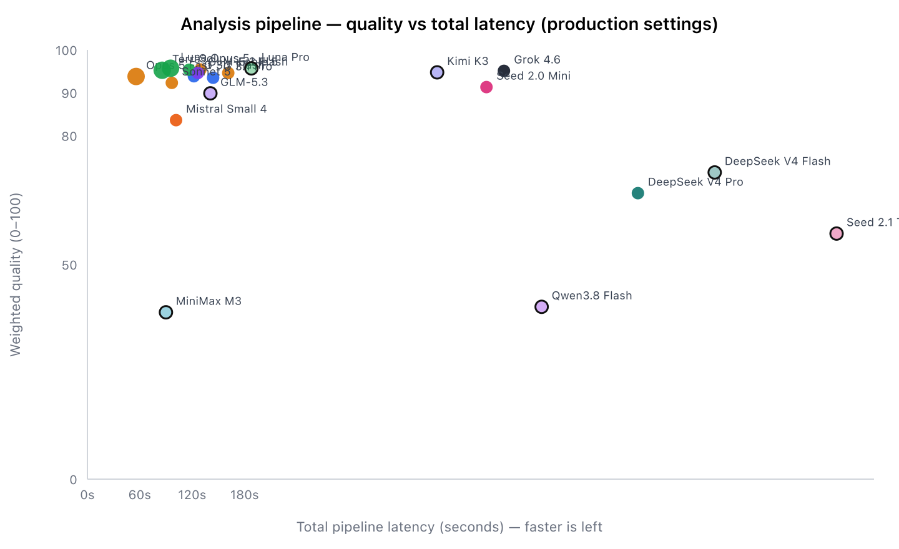
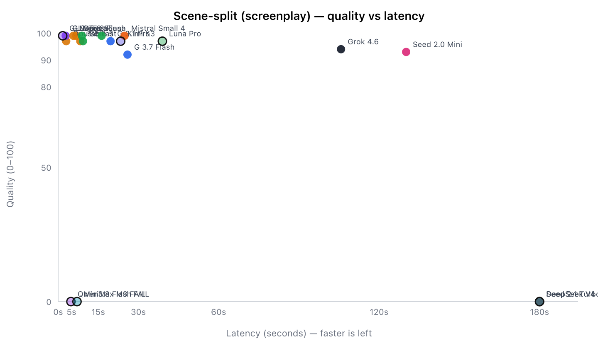

# Analysis LLM speed vs quality (2026-08-31)

OpenStory script-analysis pipeline, every LLM call, frozen gold inputs.

**Not user-facing.** Internal eval — `docs/architecture/` is excluded from the published guide. Gist (graphs + interactive HTML): https://gist.github.com/tombeckenham/0429deab8882b0832937f611f239f6e9

Re-run:

```bash
bun --env-file=.env.local scripts/eval-analysis-speed-quality.ts --out .tmp/eval-analysis
```

## Graphs



Filled = in catalog. Outlined = candidate not in the catalog. Left = faster.



Interactive Chart.js version: `scripts/eval-analysis-speed-quality.ts` writes `.tmp/eval-analysis/index.html`. This page is **not** in the published user/developer guide (`docs/architecture/` is excluded from content-collections).

## Method

- Same frozen Coral screenplay + 9-beat prose ad for every model
- Later stages do **not** consume that model's own earlier output
- Production prompts + schemas; all traffic via OpenRouter
- Motion prompts attach a rendered starting still when the model is vision-capable
- Quality = 55% structural + 45% blinded Gemini 3.7 Flash judge (where a judge ran)
- Production effort: `medium` on split/bibles/auto-style/visual/motion; `none` on talent/location/music

## Production ranking (all 9 calls)

| Model                                    | Quality | Pipeline sec |       Cost | Notes                                                                             |
| ---------------------------------------- | ------: | -----------: | ---------: | --------------------------------------------------------------------------------- |
| **GPT-5.6 Luna**                         |    95.7 |          95s |     $0.015 | Best catalog speed/quality                                                        |
| GPT-5.6 Luna Pro _(candidate)_           |    95.7 |         188s |     $0.052 | Same quality, 2× slower                                                           |
| Claude Opus 5                            |    95.4 |         129s |      $0.40 |                                                                                   |
| GPT-5.6 Sol                              |    95.4 |         116s |      $0.12 |                                                                                   |
| GPT-5.6 Terra                            |    95.3 |          86s |      $0.13 |                                                                                   |
| Grok 4.6                                 |    95.1 |     **477s** |      $0.23 | Quality fine, unusable latency                                                    |
| **Kimi K3** _(candidate)_                |    94.8 |         400s |      $0.16 | Only new model that finished the full pipeline at catalog quality **with vision** |
| Claude Fable 5 _(current default)_       |    94.6 |         161s |  **$0.85** | Most expensive, not the quality winner                                            |
| **GLM-5.3 Flash** _(in catalog, vision)_ |    94.6 |         127s | **$0.006** | Cheapest in-catalog; motion-with-still 89/2.5s                                    |
| Claude Opus 5 Fast _(scene-split)_       |    93.8 |      **56s** |      $0.80 | Fastest complete Anthropic pipeline                                               |
| GLM-5.3 _(candidate, text-only)_         |    89.9 |         141s |      $0.07 | Fastest split (1.7s) + best bibles (93); talent match scored 0                    |
| Mistral Small 4                          |    83.6 |         102s |      $0.01 | Weak motion (54) and location (60)                                                |
| DeepSeek V4 Pro                          |    66.6 |         630s |      $0.10 | Timed out on both scene-splits (180s)                                             |

Pareto on quality × total latency: **Luna, Terra, Opus 5 Fast**.

## Scene-split (why we pin Opus 5 Fast)

| Model                                   | Quality |         Time |
| --------------------------------------- | ------: | -----------: |
| GLM-5.3 _(candidate)_                   |      99 |     **1.7s** |
| GLM-5.3 Flash                           |      99 |         2.8s |
| **Opus 5 Fast**                         |      97 |         3.0s |
| Sonnet 5                                |      99 |         5.7s |
| Fable 5                                 |      97 |         8.3s |
| Luna                                    |      99 |          16s |
| Kimi K3                                 |      97 |          23s |
| Grok 4.6                                |      94 |     **106s** |
| Seed 2.0 Mini                           |      93 |     **130s** |
| DeepSeek V4 Pro / Flash, Seed 2.1 Turbo |    fail | 180s timeout |

## GLM-5.3 vs GLM-5.3 Flash

Two different OpenRouter ids:

| Model                | In catalog? | Vision  | Structured output                                   |
| -------------------- | ----------- | ------- | --------------------------------------------------- |
| `z-ai/glm-5.3-flash` | Yes         | **Yes** | Yes                                                 |
| `z-ai/glm-5.3`       | No          | **No**  | Yes (the old “no structured outputs” note is stale) |

Flash already runs the image-conditioned motion path. Full 5.3 would need a vision companion. Today `resolveVisionModel` sends every text-only model to Sonnet 5. A same-family fallback **5.3 → 5.3 Flash** is cheaper and more consistent than Sonnet; it is not wired yet.

## Reasoning

Higher effort did not buy scene-split quality and often cost 3–6× latency (Luna low 99/8.4s vs high 99/54s). Keep `medium` (or `low` on user-facing streams).

## Candidates

**Worth a trial:** `moonshotai/kimi-k3` (vision, full pipeline 94.8). `z-ai/glm-5.3` if we add a Flash vision companion.

**Do not add as analysis models:** MiniMax M3 (structured-output missing), Qwen3.8 Flash (rate-limits + timeouts), Seed 2.1 Turbo (split/bibles timeout), DeepSeek V4 Flash (same), Luna Pro (same quality as Luna, slower).

**Not on OpenRouter:** Claude Mythos 5.

## Re-run

```bash
bun --env-file=.env.local scripts/eval-analysis-speed-quality.ts
bun --env-file=.env.local scripts/eval-analysis-speed-quality.ts --quick
bun --env-file=.env.local scripts/eval-analysis-speed-quality.ts --resume --out .tmp/eval-analysis
```

Raw rows: `results.json` in the eval output dir (not in this gist; 155KB).
