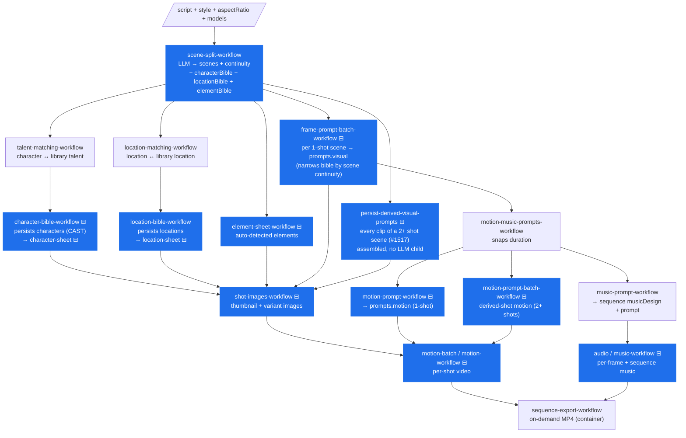
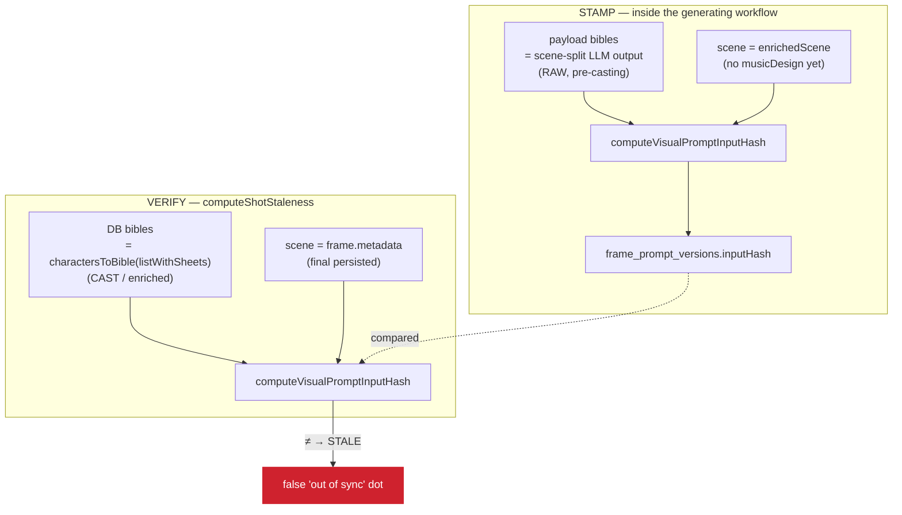
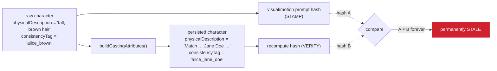

# Prompt & artifact staleness — the dependency graph

> Issue [#867](https://github.com/openstory-so/openstory/issues/867): _"When
> generating a new sequence, image and motion prompts always appear stale.
> Validate the dependency graph and hash calculation across all areas, create a
> doc that graphs it out clearly, then correct inconsistencies."_

This doc is the map. It graphs **what input, when changed, makes which artifact
stale**, and then pins down the places where the graph is computed
_inconsistently_ between the moment an artifact is generated (**stamp**) and the
moment the UI checks it (**verify**) — which is what produces the false-positive
"out of sync" dots on a brand-new sequence.

It is the operational companion to
[workflow-snapshots-and-content-hash-staleness.md](./workflow-snapshots-and-content-hash-staleness.md)
(the design) — read that first for _why_ we hash inputs at all.

## Status — implemented in #867, re-fixed on a new path in #1732

All three defects below are now **fixed**; §5/§6 are kept as the rationale.
The doc pre-dates the frames→shots redesign, so it still says "frame" where the
code now says "shot"; the file map in §7 is current.

1. **Membership moved upstream.** Scene-split now emits each scene's `continuity`
   (`response-schemas.ts`); the visual-prompt LLM no longer authors it. The
   visual/motion prompt workflows **narrow their bible input to the scene's
   entities before the LLM call** (`frame-prompt-workflow.ts`,
   `motion-prompt-workflow.ts`) — the model and the hash see the same
   minimal input.
2. **Cast bible fed into prompt generation.** `analyze-script-workflow.ts`
   computes the cast bible (`buildCastCharacterBible`) right after talent matching
   and hands it to the prompt branches, so the stamped hash equals the cast DB row
   read at verify time.
3. **Hash scoped to real drivers.** `input-hash.ts` projects each bible entry to
   its prompt-driving fields (drops `characterId`/`locationId`/`consistencyTag`/
   `firstMention`) and uses an allowlist scene surface;
   `PROMPT_INPUT_HASH_VERSION` went to 4. It is **5** today — v5 additionally
   dropped every display label (`name`, `metadata.title`) and `sceneNumber`,
   with v4 kept as a verify fallback.

### The same defect, again, on a path #867 predates (#1732)

#1517 added a **second** visual-prompt stamp site: `persist-derived-visual-prompts`
in `analyze-script-workflow.ts` writes the image prompt for every clip of a
**2+ shot scene** without an LLM child. It passed the raw pre-cast
`characterBible` — defect A below, reintroduced — so every clip of every
multi-shot scene read stale from birth whenever a character was talent-cast,
and with no `Changed:` line, because no input row was newer than the artifact.
Fixed by handing it `castCharacterBible`, the same bible the prompt children
get.

**The rule this leaves behind:** a new stamp site takes the cast bible, never
the payload bible. `buildCastCharacterBible` is computed once in
`analyze-script-workflow.ts` and is the only character bible any hash may see
inside that run. A stamp↔verify test whose bible is empty cannot catch this —
cast and raw are then identical — so the round-trip test (§6-4) must use a
talent-cast character, tagged in `continuity.characterTags` so narrowing keeps
it.

---

> Interactive version: `/docs/dependency-graph` in the app (#1595), data in
> `src/ui/docs/dependency-graph.ts`. Keep it in step with `input-hash.ts`.

## 1. The model in one paragraph

Every generated artifact stores a **SHA-256 hash of its inputs** next to the
version row that carries it (`frame_prompt_versions.inputHash`,
`shot_prompt_versions.inputHash`, `frame_variants.inputHash`,
`characters.sheetInputHash`, …). Staleness is a **derived read**, never a stored
flag:

```
stored hash == null            → "untracked"  (never generated / legacy — no opinion)
stored hash == recompute(now)  → "fresh"
stored hash != recompute(now)  → "stale"      (an input changed → show "regenerate")
```

Two verdicts sit outside that compare, both in `ArtifactStaleness`
(`shot-staleness.ts`): **`generating`** short-circuits a shot with a run in
flight (#1121 — the reason a fresh sequence must not be judged mid-run) and
**`updating`** a shot with a pending Update-all claim (#1085); `unknown` is the
no-context case.

`recompute(now)` reads the **current persisted state** and re-derives the hash.
Helpers live in [`src/shots/input-hash.ts`](../../src/shots/input-hash.ts). The
compare is not `stored === live`: `visualPromptInputHashMatches` /
`motionPromptInputHashMatches` also accept the previous digest shapes (v4, and
the v5 named / titled variants) until `LEGACY_HASH_UNTIL` (2026-09-28, #1371),
so a version bump doesn't re-stale the world.

**The invariant that must hold:** the hash computed at **stamp time** (inside the
generating workflow) and the hash computed at **verify time** (inside
`computeShotStaleness`) must be byte-identical _whenever nothing the user cares
about has changed_. Every false-positive in this doc is a place where stamp ≠
verify even though nothing changed.

---

## 2. The generation DAG

What feeds what, top to bottom. Each box is a durable workflow; each arrow is a
data dependency. Boxes that **stamp an input-hash** are marked `⊟`.



The two prompt artifacts this issue is about — **`prompts.visual`** and
**`prompts.motion`** — sit in the middle. Each has **two** stamp sites: the LLM
child for a 1-shot scene, and the assembled derived path for every clip of a 2+
shot scene (#1517). Both must hash the same bible (#1732).

> **Ordering detail (inconsistency C below):** the frame-prompt batch and
> `character-bible-workflow` are still spawned **in parallel** in Phase 3 of
> [`analyze-script-workflow.ts`](../../src/sequences/server/workflows/analyze-script-workflow.ts)
> (one `Promise.allSettled`). That race is harmless _only_ because the cast
> bible is computed **before** the spawn, from the same inputs
> `create-cast-records` persists — the prompts hash the value the bible
> workflow is concurrently writing, not the value it started from. Defused by
> construction, not by ordering, which is why a new stamp site that reaches for
> `characterBible` instead reopens it (#1732).

---

## 3. The staleness dependency graph (the answer to "what causes staleness")

Read every arrow as: **"if this input changes, the target artifact becomes
stale."** Diamonds are inputs; rounded boxes are hashed artifacts.

```mermaid
flowchart LR
    subgraph inputs["upstream inputs"]
        scene{{"scene input surface<br/>originalScript<br/>· metadata location/timeOfDay/storyBeat<br/>· continuity tags pick the bible entries"}}
        style{{"styleConfig"}}
        cbible{{"character bible<br/>(age, physicalDescription, …)<br/>name is a display label"}}
        lbible{{"location bible"}}
        ebible{{"element bible<br/>(description; token is a label)"}}
        eimage{{"element image"}}
        ar{{"aspectRatio"}}
        amodel{{"analysisModel<br/>(pinned per prompt)"}}
        lines{{"shot lines<br/>(shot_dialogue_versions)"}}
        refonly{{"shot reference-only"}}
        dur{{"shot durations"}}
        tags{{"music tags"}}
        voice{{"character voiceId<br/>(ElevenLabs or Seed voice)"}}
        libref{{"library location<br/>reference hash"}}
    end

    scene --> VP(["visual prompt hash"])
    style --> VP
    cbible --> VP
    lbible --> VP
    ebible --> VP
    ar --> VP
    amodel --> VP

    scene --> MP(["motion prompt hash"])
    style --> MP
    cbible --> MP
    lbible --> MP
    ebible --> MP
    ar --> MP
    amodel --> MP
    lines --> MP
    refonly --> MP
    TH -. "still URL" .-> MP

    VP -. "fullPrompt text" .-> TH(["still hash"])
    ar --> TH
    CS(["character sheet"]) -. "selected version id" .-> TH
    LS(["location sheet"]) -. "selected version id" .-> TH
    eimage --> TH

    cbible --> CS
    style --> CS
    TS(["talent sheet hash"]) --> CS
    talentrow{{"talent description<br/>+ default sheet image/look"}} --> CS

    lbible --> LS
    style --> LS
    libref --> LS

    TH -. "still version id" .-> VID(["clip manifest"])
    MP -. "prompt version id" .-> VID
    dur --> VID
    lines --> VID
    voice --> VID
    refonly --> VID
    CS -. "sheet sent" .-> VID
    LS -. "sheet sent" .-> VID
    eimage -. "image sent" .-> VID

    scene --> MUSIC(["sequence music-prompt hash"])
    dur --> MUSIC
    amodel --> MUSIC
    MUSIC -. "prompt text" .-> AUD(["music track hash"])
    tags --> AUD
    dur --> AUD
```

Key consequences of the shape:

- **Prompts depend on the _text_ of the bibles**, not on the sheet images. Edit a
  character's `physicalDescription` and the visual + motion **prompts** go stale;
  the rendered thumbnail goes stale only because the **character-sheet hash**
  changes and feeds the thumbnail hash.
- **The style snapshot is versioned (#1600).** Each create, switch and
  automatic derivation appends a `sequence_style_versions` row, so a stale
  prompt names the knobs that moved (`Style: lighting`).
- **A scene's narrative is versioned with its script (#1600).** Heading, time
  of day, story beat, title and continuity tags live on the selected
  `scene_script_versions` row, so an edit to any of them appends a row, and a
  stale prompt names the field: `Scene: time of day`. The title stays a label
  (never hashed, never a cause); continuity is named as "cast and tags",
  because it decides which bible entries a scene's prompts hash.
- **Bibles are versioned (#1600).** Each edit, recast or re-analysis
  appends a `character_bible_versions` / `location_bible_versions` row, and
  sheets record the version they read. The edges above are unchanged — the
  hashes still read the bible's values — but a stale artifact's cause now
  names the fields that moved (`Character "Jack": clothing`) instead of any
  row touched after it.
- **Voice ids bind on the clip**, not the motion prompt. A voice id (an
  ElevenLabs id, or a `seed:` id for a Seed voice, #1765) is in
  `VideoManifestEntry.audioSourceKey` (shape-stable: omitted when
  voiceless), the sheet analogue of `characterSheetHashes` on the still. The
  LLM never sees it, so swapping a voice re-stales the render, not the prompt.
- **A shot line edit re-stales the motion prompt and the clip (#1784).** The
  lines live on the shot (`shot_dialogue_versions`), not the script, so the
  motion prompt hash and the motion LLM read them through
  `shotDialogueResolver` (the `dialogue` channel), and the clip manifest
  records every line its render prompt quoted (`dialogueKey`), voiced or not.
  The visual prompt still reads the scene script: a still has no dialogue.
- **Still → clip is a pointer, not a hash cascade.** The clip manifest records
  the still version and motion-prompt version it was rendered from, and the
  compare (`isSelectedVersionStale`) checks them against the shot's current
  selections. A stale still does not stale the clip; selecting a new still
  does. The same holds for the sheets and element images a render sent
  (`referenceKeys`): re-selecting one re-stales the clip.
- **A new still re-stales the motion prompt.** The motion prompt is written
  looking at the still, so its hash reads the still's URL (unless the shot
  renders reference-only).
- **Duration deliberately feeds the clip and music but NOT the shot prompts** —
  it's a generation parameter, not a prompt driver. (Fixed in #767; see §5-B.)
  The music brief does carry each scene's length.
- **A model switch never stales anything (#1785).** Model ids are in the
  hashes (not drawn above), but verify always recomputes with the model the
  artifact was made with: a still with its own `frame_variants.model`, a prompt with its latest
  version's `analysisModel`, a generated sheet with its selected version's
  `model` (`resolveSheetImageModel`), and the clip pointer compare ignores the
  video model entirely. So a model id only ever differs when the artifact
  itself was re-made. A sequence switch applies to
  the next generation. `findStalenessCauses` therefore never names "Image
  model" or "Script model" (they are not in `SETTINGS_CHANGED_LABELS`). One
  exception: an uploaded sheet has no model of its own, so its verify uses
  the sequence model and a switch does re-stale it.

---

## 4. Per-artifact hash inputs (authoritative reference)

Source of truth: [`src/shots/input-hash.ts`](../../src/shots/input-hash.ts).

Listed in generation order (matching §4.1):

| Artifact                      | Stamp site                                                                                                               | Verify site                                              | Hashed inputs                                                                                                                                                                       |
| ----------------------------- | ------------------------------------------------------------------------------------------------------------------------ | -------------------------------------------------------- | ----------------------------------------------------------------------------------------------------------------------------------------------------------------------------------- |
| **Talent sheet** (library)    | `library-talent-sheet-workflow`                                                                                          | none (no talent staleness check)                         | talent description, referenceMediaHashes (sorted set), imageModel                                                                                                                   |
| **Character sheet**           | `character-sheet-workflow`                                                                                               | `readReferenceStaleness`                                 | character bible fields, talentSheetHash, cast talent (description, default sheet image + look), styleConfigHash, imageModel                                                         |
| **Location sheet**            | `location-sheet-workflow`                                                                                                | `readReferenceStaleness`                                 | every location bible field the sheet prompt reads, libraryLocationReferenceHash, styleConfigHash, imageModel                                                                        |
| **Visual prompt**             | `frame-prompt-workflow.ts` (1-shot) · `persist-derived-visual-prompts` in `analyze-script-workflow.ts` (2+ shots, #1517) | `computeShotStaleness`                                   | scene input surface, styleConfig, character/location/element bibles (narrowed, **cast**), aspectRatio, analysisModel, `PROMPT_INPUT_HASH_VERSION`                                   |
| **Motion prompt**             | `motion-prompt-workflow.ts` · `motion-prompt-batch-workflow.ts` (derived)                                                | `computeShotStaleness`                                   | _same as visual_, plus starting-frame URL and `referenceOnly`. Voice ids are **not** a prompt channel.                                                                              |
| **Sequence music prompt**     | `music-prompt-workflow`                                                                                                  | `readMusicPromptStaleness`                               | sceneSummaries, analysisModel                                                                                                                                                       |
| **Thumbnail / variant image** | `shot-images-workflow.ts` / `image-workflow-snapshot.ts`                                                                 | `computeShotStaleness` via the regenerate-shots snapshot | effective visual prompt text (element tokens read as the element id, #1827), imageModel, aspectRatio, size, seed, characterSheetHashes, locationSheetHashes, elementReferenceHashes |
| **Shot video**                | `motion-workflow*`                                                                                                       | pointer compare in `src/shots/scene-segments.ts`         | manifest pointers (motion-prompt / frame version ids, `usesStartFrame`, durationMs, `audioClipIds`, `audioSourceKey`, `dialogueKey`, `referenceKeys`)                               |
| **Sequence music track**      | `music-workflow`                                                                                                         | `musicTrackStaleness`                                    | music prompt text, tags, durationSeconds (clamped), audioModel                                                                                                                      |

Two cross-cutting normalizations make the hash order-insensitive and
default-stable:

- `canonicalize()` sorts object keys and **throws** on `undefined` (callers must
  pass `null` / `''`).
- Set-like fields (sheet-hash lists, music tags, bibles) are sorted before
  hashing — bibles by their identity field (`characterId` / `locationId`;
  elements by `description`, since the token is a label).
- Element tokens in hashed text (scene script, still prompt) are swapped for
  the element's identity before hashing (`elementTokensToKeys`, #1827): its
  row id on a still, its description in a prompt. An element token rename
  therefore stales nothing. Models still receive the tokens.

### 4.1 The exact bytes hashed, per artifact (in generation order)

Every helper builds **one plain object** and runs it through
`canonicalize()` (recursively sort keys, **throw** on `undefined`) →
`JSON.stringify` → `crypto.subtle.digest('SHA-256')` → hex. The literal object
below _is_ the hash input — nothing else is mixed in. Two shared normalizers
appear throughout:

```ts
const trim = (s) => (s ?? '').trim(); // nullish → '', then trim
const sortedRefs = (refs) => [...(refs ?? [])].sort(); // order-insensitive set
```

> **The staleness graph is narrower than the generation DAG.** The **script**
> and the **scene** are not hashed as standalone artifacts — they enter the
> graph only as _inputs_ to the **prompt** hashes (the prompt's `scene` surface
> embeds `originalScript`). Each artifact below hashes its **direct** inputs —
> the _persisted entities_ (bibles, sheets, style, models), **not** the upstream
> script those entities were derived from.
>
> **Concretely:** editing a scene's script flips the **visual + motion prompt**
> hashes (script text is in `scene.originalScript`), but does **NOT** flip the
> **character bible / sheet** — the sheet hash contains the character's own
> persisted fields, not the script. There is no `script → bible` edge in the
> staleness graph today. The same is true for `script → location/element bible`.
> If we want a script edit to flag the bibles, that edge has to be added
> explicitly (it isn't a hash input today).

The hashed artifacts, ordered by when they are produced in the pipeline (§2):

#### Library assets — generated outside this sequence; feed the cascade

These pre-exist a given sequence (a talent or library-location is created once in
the team library) and flow downstream as a single **hash**, not their full
contents, so regenerating them with identical inputs doesn't churn dependents.

**Talent sheet — `computeTalentSheetInputHash`**

```ts
sha256Hex({
  artifact: 'talent:sheet',
  talent: { description: trim(description) }, // the name is a label
  referenceMediaHashes: sortedRefs(referenceMediaHashes), // unordered set of talent_media rows
  imageModel,
});
```

**Library-location reference — `computeLibraryLocationReferenceInputHash`**

```ts
sha256Hex({
  artifact: 'library-location:reference',
  locationBible: { description: trim(description) }, // the name is a label
  referenceMediaHashes: sortedRefs(referenceMediaHashes),
  styleConfigHash,
  imageModel,
});
```

#### 1. Character sheet — `computeCharacterSheetInputHash`

Generated in Phase 3 from the (cast) character bible + the matched talent sheet.

```ts
sha256Hex({
  artifact: 'character:sheet',
  characterBible: {
    // a SUBSET of the bible entry — no id/firstMention, and no `name`:
    // `characterSheetHashBody(input, includeName: false)`. The named body
    // survives as a legacy verify fallback only.
    age: trim(age),
    gender: trim(gender),
    ethnicity: trim(ethnicity),
    physicalDescription: trim(physicalDescription),
    standardClothing: trim(standardClothing),
    distinguishingFeatures: trim(distinguishingFeatures),
    consistencyTag: trim(consistencyTag),
  },
  talentSheetHash: talentSheetHash ?? null, // ← cascade from the talent sheet above
  // #1785 — only when cast, so no uncast digest moved. What the sheet prompt
  // reads from the talent LIVE: a description edit or a promoted talent-sheet
  // variant (same inputHash, new image) re-stales the character sheet.
  talent: {
    description: trim(talent.description), // the talent ROW's text (`castTalentDescription`),
    //   not `talentDescription`, which recast / bible / regenerate each word differently
    sheetImageUrl: trim(sheetImageUrl), // the default convergent talent sheet
    sheetLook: { age, gender, ethnicity, physicalDescription } | null, // its metadata
  },
  styleConfigHash, // hash of the StyleConfig, not the object
  imageModel,
});
```

One resolver, `resolveCastTalent` (`sheet-snapshots.ts`), feeds the
regenerate/verify payload, the upload stamp and the workflow's divergence
recompute, so the three cannot pick different talent sheets. Pre-#1785 digests
(no talent channel) still verify until `LEGACY_HASH_UNTIL`.

#### 2. Location sheet — `computeLocationSheetInputHash`

```ts
sha256Hex({
  artifact: 'location:sheet',
  // #1785: every field `buildLocationSheetPrompt` reads — the same projection
  // as the prompt hashes (`projectLocationForPrompt`). `name` is a label.
  locationBible: {
    (type,
      timeOfDay,
      description,
      architecturalStyle,
      keyFeatures,
      colorPalette,
      lightingSetup,
      ambiance);
  },
  libraryLocationReferenceHash: libraryLocationReferenceHash ?? null, // ← cascade from library loc
  styleConfigHash,
  imageModel,
});
```

Pre-#1785 digests (description only) still verify until `LEGACY_HASH_UNTIL`.
**Known gap:** the linked library location's `description` and
`referenceImageUrl` are read live into the prompt but reach this hash only
through `libraryLocationReferenceHash`, i.e. after the library reference is
regenerated — the location twin of the talent channel above.

#### 3. Visual prompt — `computeVisualPromptInputHash`

Generated in Phase 3 from the scene + the bibles. This and the motion prompt are
the artifacts #867 is about.

```ts
sha256Hex({
  artifact: 'shot:visual-prompt',
  hashVersion: 5, // PROMPT_INPUT_HASH_VERSION — v4 survives only as a verify fallback
  scene: sceneInputContext(scene), // allowlist — see expansion below
  styleConfig: styleConfigHashBody(styleConfig), // a projection, not the whole object
  characterBible, // sorted by characterId, then PROJECTED to driving fields
  locationBible, //  sorted by locationId,  then PROJECTED to driving fields
  elementBible, //   sorted by description, projected, or null if absent
  aspectRatio: trim(aspectRatio),
  analysisModel: trim(analysisModel), // e.g. 'anthropic/claude-haiku-4.5'
});
```

**What `sceneInputContext(scene)` keeps (post-#867: an allowlist)** — only the
genuine pre-prompt inputs, so no downstream field can leak in:

```ts
{
  originalScript,                                  // ← hashed verbatim; dialogue is filtered to this shot upstream (sceneForShot / dialogueForShot), not here
  metadata: { location, timeOfDay, storyBeat },    // no durationSeconds, no title
}
// v5 also dropped `sceneId` / `sceneNumber` (identity) and `metadata.title`
// (a display label). Everything else on the scene — prompts, continuity,
// musicDesign, audioDesign, sourceImageUrl — is downstream output and is NOT
// in the allowlist.
```

> The **motion** body swaps these lines for what the shot says now
> (`sceneWithShotDialogue`, #1784) — see §4. The visual body keeps them.
>
> **The dialogue filtering happens upstream of the hash**, so it is the one
> part of the hashed surface the hasher cannot enforce. Both sides go through
> `scriptForShot` (`shot-list-pass.ts`) — `sceneForShot` at stamp time,
> `composeSceneForShot` at verify time — and a `shotNumber` / `voiceToken` that
> reached the hasher unstripped **would** be hashed. Anything added to this
> view goes in that one function, never in a caller.

**Bible entries are projected to their prompt-driving fields (post-#867)** —
entries are still sorted by their identity field, but only the fields that shape
the prose are hashed; identity / provenance / image-gen tags are dropped:

```ts
// character → 6 driving fields (drops characterId, name, consistencyTag)
{
  (age,
    gender,
    ethnicity,
    physicalDescription,
    standardClothing,
    distinguishingFeatures);
}

// + MOTION only (#1561): personality, movement — each joined only when non-empty,
//   so a character with neither moves no stored digest. A still does not walk,
//   so the visual prompt and the sheet never hash them.

// location → 8 driving fields (drops locationId, name, consistencyTag, firstMention)
{
  (type,
    timeOfDay,
    description,
    architecturalStyle,
    keyFeatures,
    colorPalette,
    lightingSetup,
    ambiance);
}

// element → 1 driving field (drops token, consistencyTag, firstMention)
{
  description;
}
```

`name` is a **display label**, dropped in v5 along with `metadata.title`: a
rename must not flag every prompt stale. The `*ForPromptV4` projections re-add
it for legacy verify only. An element's token is the same kind of label
(#1827): the bible drops it and the scene text reads it as the element's
description, so a rename stales nothing. The `v5-tokened` shape re-adds the
raw token for legacy verify only.

The LLM still receives the full, narrowed entries; only the **hash** is the
projection. Combined with the cast bible feeding generation, a casting rewrite no
longer flips the prompt hash (`physicalDescription` is now identical on both
sides; `consistencyTag` is no longer hashed at all).

> The bibles are first **narrowed** to the entries this scene references
> (`narrowFramePromptContext`) and then **sorted** by identity field, but the
> entries themselves are hashed field-for-field. A single differing character
> field (e.g. a cast `physicalDescription`) flips the whole digest.

#### 4. Motion prompt — `hashMotionPromptInput`

Generated in Phase 4. Same scene surface, bibles, style, aspectRatio,
analysisModel and hashVersion as the visual body, plus `startingFrameImageUrl`,
`referenceOnly` (the flag joins the body only when true) and each character's
`personality` / `movement` (#1561). Discriminator is
`artifact: 'shot:motion-prompt'`.

The scene's script lines are **replaced** by the shot's own lines — the
required `dialogue` channel, resolved by `shotDialogueResolver` at every
stamp and verify (#1784). `sceneWithShotDialogue` builds that scene for both
the LLM and this hash, dropping `voiceToken`. So a shot line edit re-stales
the motion prompt and a regenerate quotes the edit. An unedited shot whose
node row holds the script's lines hashes to the same digest as before #1784.
Verify still accepts a digest hashed over the script's lines, but only for a
shot with no node row (`legacyScriptDialogue`, until `LEGACY_HASH_UNTIL`):
there the difference is the resolver reading old data (unstamped pre-#1585
lines, a pre-#1657 prompt row), not an edit.

Voice ids are **not** in this hash. They bind on the clip
(`VideoManifestEntry.audioSourceKey`), the sheet analogue of
`characterSheetHashes` on the still — the LLM never sees the voice id, so
swapping a voice must not rewrite the prompt.

#### 5. Sequence music prompt — `computeMusicPromptInputHash`

Generated in Phase 4 alongside motion prompts.

```ts
sha256Hex({
  artifact: 'sequence:music-prompt',
  hashVersion: 6,
  // One row per scene with shots, in scene order: storyBeat, location,
  // timeOfDay, and the scene's shot durations summed. Scene id and title
  // are dropped (order is the key; the title is a label).
  sceneSummaries,
  analysisModel: trim(analysisModel),
});
```

The summaries have ONE builder (`src/audio/server/workflows/music-scene-summaries.ts`),
fed the scene's narrative and its shots' durations on both sides (#1783). The
pipeline stamp reaches it through `musicSceneSummariesFromAnalysis`, which runs
the analysis scenes through `buildSceneNarrative` and `sceneShotSpecs` — the
builders that wrote the split script version and the shot rows (#1600) — so it
needs no mid-run read. Verify,
regenerate, Update all and smart retry use `musicSceneSummariesFromRows`.
Before #1783 the pipeline stamped per-scene summaries with the analysis scene
id, the snapped scene label and the visual prompt, while verify hashed one row
per shot with the row id and an empty visual prompt, so every pipeline music
prompt read stale from birth. The visual prompt is no longer part of the brief:
no regenerate path ever sent it, and hashing it would re-stale the track on
every still-prompt tweak.

Legacy: until `LEGACY_HASH_UNTIL`, verify also accepts the pre-#1783 per-shot
digests (`musicSceneSummariesFromRows`' `legacyShotSummaries`), so prompts
stamped by a regenerate stay fresh on deploy. Pipeline stamps from before
#1783 never matched and stay stale; Update all regenerates them.

#### 6. Thumbnail / variant image — `computeShotImageInputHash`

Rendered from the visual prompt text + the character/location sheet hashes.

```ts
sha256Hex({
  artifact: `shot:${kind}`, // 'shot:thumbnail' | 'shot:variant-image'
  // The composed fullPrompt TEXT, each element token read as the element id (#1827).
  visualPrompt: elementTokensToKeys(trim(visualPrompt), elementTokens),
  imageModel,
  aspectRatio,
  size: size ?? null,
  seed: seed ?? null,
  // Each = the selected sheet version id, else the sheet's input hash, so a
  // re-selected sheet re-stales the still even with identical inputs.
  characterSheetHashes: sortedRefs(characterSheetHashes),
  locationSheetHashes: sortedRefs(locationSheetHashes),
  elementReferenceHashes: sortedRefs(elementReferenceHashes), // element image URLs
});
```

#### 7. Clip / frame video — `computeVideoManifestInputHash`

The stamp is over the render manifest (motion-prompt / still version ids,
`usesStartFrame`, duration, `audioClipIds`, `audioSourceKey`, `dialogueKey`). The UI compare
(`isSelectedVersionStale`) is pointer-based: stored entries vs the shot's
current prompt / still version ids **and** the live `audioSourceKey` (voice
id, line, tone and TTS model, omitted when voiceless). A voice change therefore
re-stales the clip, not the motion prompt. The TTS model follows the voice
(`eleven_v3` for an ElevenLabs voice, `seed-audio-1.0` for a Seed voice,
#1765), so it moves only when the voice does.

`dialogueKey` (#1784) is every line the render prompt quoted, voiced or not,
with its bound voice token (`dialogueLinesKey`). `audioSourceKey` sees voiced
lines only, and is null on a model without dialogue-audio input, yet every
audio-capable model splices all lines into its prompt. It is null when nothing
was quoted — no lines, no motion prompt, or a model without audio — and the
compare applies the same rule to the live side. A manifest from before #1784
has no key and is not compared.

```ts
sha256Hex({
  artifact: 'video:manifest',
  model,
  manifest: entries.map(canonicalizeManifestEntry),
  // each entry: shotId, motionPromptVersionId, frameVersionId,
  // usesStartFrame, durationMs, audioClipIds (dropped when []),
  // audioSourceKey (dropped when null), dialogueKey (dropped when null),
  // referenceKeys (sorted, dropped when [])
});
// A manifest whose pointers are ALL null hashes to `null`, not a digest (#1380):
// no provenance is not the same claim as "generated from nothing".
```

#### 8. Sequence music track — `computeSequenceMusicInputHash`

```ts
sha256Hex({
  artifact: 'sequence:music',
  prompt: trim(prompt),
  tags: trim(tags), // comma-joined string from sequences.musicTags
  durationSeconds,
  audioModel,
});
```

### 4.2 Hashed surface vs. actual prompt inputs — are we over-hashing? (history)

> **This subsection is the #867 analysis as written, kept for the reasoning.**
> Its two 🔴 findings shipped and no longer describe the code: the per-entry
> over-hash is gone (entries are projected — §4.1), and the LLM now receives the
> **narrowed** bibles, narrowed further per artifact (`voiceOnly` characters and
> the performance fields are kept out of the still prompt, #1585 / #1561). Only
> the neighbour-scene under-hash is still open; it is restated under §6.

A correct staleness hash should cover **exactly** the inputs that, if changed,
would change the regenerated prompt — no more (over-hash → false "stale"), no
less (under-hash → missed staleness). Here is the visual-prompt hash as it stood
in #867, measured against what the prompt LLM was handed
([`frame-prompt-workflow.ts`](../../src/stills/server/workflows/frame-prompt-workflow.ts),
`getChatPrompt('phase/visual-prompt-scene-generation-chat', …)`):
`sceneBefore`, `sceneAfter`, `scene`, `characterBible`, `locationBible`,
`elementBible`, `styleConfig`, `aspectRatio`.

| LLM receives                                                                                                                                                                             | Real prompt driver?                                        | In the hash?                            | Verdict                                                       |
| ---------------------------------------------------------------------------------------------------------------------------------------------------------------------------------------- | ---------------------------------------------------------- | --------------------------------------- | ------------------------------------------------------------- |
| `scene` appearance surface (`originalScript`, metadata `title`/`location`/`timeOfDay`/`storyBeat`)                                                                                       | yes                                                        | yes                                     | ✅ aligned                                                    |
| `scene.metadata.durationSeconds`                                                                                                                                                         | no (video param)                                           | no — stripped                           | under-hash, intentional (#767)                                |
| `sceneBefore` / `sceneAfter` (neighbour scenes)                                                                                                                                          | **yes** (continuity context)                               | **no**                                  | under-hash, **deliberate** (#1785, see §6)                    |
| **all** character / location / element entries                                                                                                                                           | yes (LLM sees the full set as context)                     | **narrowed** to referenced entries      | ⚠️ under-hash on unreferenced entries (intentional, #683)     |
| referenced entry → appearance fields (`name`, `age`, `gender`, `ethnicity`, `physicalDescription`, `standardClothing`, `distinguishingFeatures`; location `description`/`keyFeatures`/…) | yes                                                        | yes (whole entry)                       | ✅ aligned                                                    |
| referenced entry → **provenance / identity / tags** (`characterId`, `locationId`, `consistencyTag`, `firstMention`)                                                                      | **no** — internal IDs, an image-gen tag, script provenance | **yes** (rides in the whole-entry hash) | 🔴 **over-hash**                                              |
| `styleConfig` (all fields)                                                                                                                                                               | mostly                                                     | yes (full)                              | ✅ (possible minor over-hash if the template ignores a field) |
| `aspectRatio`, `analysisModel`                                                                                                                                                           | yes                                                        | yes                                     | ✅ aligned                                                    |

**Net:** the hash is **narrower** than the real LLM input in scope (it drops
`sceneBefore`/`sceneAfter`, `durationSeconds`, and unreferenced entries) but
**wider** per-entry — it carries bible fields that don't drive the prompt prose.

**Why the over-hash matters for #867:** `consistencyTag` is one of the two fields
`buildCastingAttributes` rewrites (the other is `physicalDescription`). So even
setting aside the raw-vs-cast _source_ asymmetry (§5-A), the prompt hash flips
when casting rewrites the tag — a field the prompt text doesn't use. The same
shape bites on benign churn: re-extracting continuity can shift
`firstMention.lineNumber`, and that alone would flag every location-bearing
prompt stale. Hashing only the **prompt-driving projection** of each bible entry
(appearance/description fields; drop IDs, `consistencyTag`, `firstMention`)
removes this whole false-positive class.

> This does **not** fully resolve #867 by itself — `physicalDescription` is _also_
> cast-rewritten and _is_ a genuine driver, so it would still flip under the
> source asymmetry. The source fix (§6-1) remains primary; the projection (§6-5)
> is a complementary tightening that also fixes the `firstMention` /
> `consistencyTag` churn classes.

This becomes **correction #5** in §6.

---

## 5. Where stamp ≠ verify — the inconsistencies (as found in #867)

The symmetry contract from §1 says: _for the same logical inputs, the stamp-time
hash and the verify-time hash must be identical._ The two sides reconstruct the
hash from **different sources**, and that is where it breaks. **A and B are
shipped fixes; C is defused rather than removed** — the diagram below is the
_broken_ state, kept because #1732 proved a new stamp site can walk straight
back into it.

The stamp and the verify still build their scene from different rows — an
in-memory analysis `Scene` at trigger time, the selected
`scene_script_versions` row (script and narrative, #1600) afterwards — but the **narrowing they apply to it is
one function**, `scriptForShot` (#1732). `scene-script.test.ts` hashes the two
builders against each other for the same underlying script, so a one-sided
change to the hashed script view fails there rather than in a user's sequence.



### A. Casting / enrichment asymmetry — **the #867 root cause** ✅ fixed (twice: #867, #1732)

The visual & motion prompt hashes were stamped from the **raw scene-split
character bible** carried in the workflow payload. But the
`character-bible-workflow` **rewrites** several of those exact fields when it
persists the character, via
[`buildCastingAttributes`](../../src/cast/character-prompt.ts) whenever a
character is matched to library talent:

| field                          | raw scene-split value (hashed at stamp) | persisted value (hashed at verify)                                            |
| ------------------------------ | --------------------------------------- | ----------------------------------------------------------------------------- |
| `physicalDescription`          | script-derived text                     | `"Match the real-world appearance of {talent} exactly…"` (or talent metadata) |
| `consistencyTag`               | LLM tag e.g. `detective_sarah_blonde`   | `{characterId}_{slugify(talentName)}`                                         |
| `age` / `gender` / `ethnicity` | script values                           | talent metadata when present                                                  |



Because casting is applied at **persist** time but not at **stamp** time, the two
hashes can never agree — the prompt is reported stale **immediately, with nothing
edited, on every sequence that has a talent-matched character.** A developer or
team with a populated talent library hits this on _every_ sequence, which reads
as "always stale."

The same shape (stamp = raw payload, verify = transformed DB row) is latent for
any future bible enrichment, and partially present for library-location matches.

> **Fixed by computing the cast bible once, before any stamp site is reached**
> (`analyze-script-workflow.ts`, `buildCastCharacterBible`). Every prompt
> payload downstream carries that bible; the raw one goes only to
> `character-bible-workflow` and `createCastRecords`, which apply casting
> themselves. #1732 is what happens when a stamp site added later reaches for
> the raw name that is still in scope.

> Note: `#683` already made both sides call `narrowFramePromptContext` so that
> _unreferenced_ entities don't poison the hash. That fixed a real bug but is
> orthogonal: narrowing selects the same _set_ of entities; this issue is that
> the selected entities have **different field values** on each side.

### B. Denylist scene-input surface — latent fragility ✅ fixed (#867: now an allowlist)

`sceneInputContext()` in `input-hash.ts` strips downstream LLM output from the
scene before hashing, but it does so with a **denylist**:

```ts
// strips: prompts, continuity, metadata.durationSeconds
// LEAVES IN: musicDesign, audioDesign, sourceImageUrl
```

Those left-in fields are _also_ downstream outputs. They aren't written back into
`frame.metadata` today (so this isn't currently firing), but the moment any code
path persists a "complete scene" — e.g. writing `musicDesign` or a generated
`sourceImageUrl` onto the frame — every prompt hash silently flips stale. This is
exactly the failure mode of #767 (`durationSeconds`), one field over. A
**denylist invites the next #767**; an **allowlist** closes the class.

### C. Visual-parallel vs motion-sequential ordering 🟡 defused, not removed

The frame-prompt batch still runs **in parallel** with the bible workflows that
persist the cast characters, while the motion prompts run a phase later, after
those bibles are persisted. The race is harmless only because both branches are
handed the **same pre-computed cast bible**, so neither is reading a row the
other is mid-write. The ordering itself was never fixed (§6-3 is still open),
which is why the bible must keep arriving by payload rather than by re-reading
D1 — the same rule the workflow-snapshot doc states for every mid-run read.

---

## 6. Recommended corrections

Ordered by value / risk. **1, 2, 4 and 5 shipped; 3 is still open** (see C).

1. ✅ **Stamp prompt hashes from the same representation verify reads (fixes A).**
   The persisted character/location bible is the canonical "current inputs"; the
   transient scene-split payload is not. Feed the **cast** character bible (the
   output of `buildCastingAttributes`, computed once in `analyze-script-workflow`
   after talent matching) to the visual + motion prompt workflows, so the value
   hashed at stamp time equals the value persisted and re-hashed at verify time.
   This also means the prompt LLM sees the cast character — arguably more correct.
   _Single source of truth for the bible removes the asymmetry by construction._

2. ✅ **Convert `sceneInputContext` to an allowlist (fixes B).** Hash only the genuine
   pre-prompt scene inputs — `originalScript` and
   `metadata.{location, timeOfDay, storyBeat}` (no `sceneId`/`sceneNumber`/
   `title`: identity and display labels) — so no future downstream
   field can poison the prompt hash. Backward-compatible: for a scene with none of
   `musicDesign`/`audioDesign`/`sourceImageUrl`, the allowlist output is identical
   to today's denylist output, so existing fresh hashes stay fresh.

3. ⏳ **Re-order the DAG so prompts depend on finalized bibles (addresses C).** Make
   the frame-prompt batch consume the persisted/cast bibles rather than racing
   their persistence. Larger change; do it once 1–2 land if any residual flake
   remains.

4. ✅ **Add a stamp↔verify round-trip test.** Today's `prompt-context.test.ts` reuses
   the _same_ bible objects on both sides, so it can't catch a source-asymmetry.
   Add a test that stamps from a raw payload bible and verifies from a
   `charactersToBible(persistedCastRow)` bible and asserts the hashes match.

5. ✅ **Hash only the prompt-driving projection of each bible entry (tightens §4.2).**
   The prompt hash currently embeds whole bible entries, including fields the
   prompt prose never uses — `characterId`, `locationId`, `consistencyTag`,
   `firstMention`. Project each entry to its appearance/description fields before
   hashing. This removes a class of false positives (`consistencyTag` casting
   churn, `firstMention.lineNumber` drift on re-extraction) independent of the
   source fix. Mirror the projection on both stamp and verify sides so they stay
   symmetric.

### Deliberately not hashed (#1785)

- **Neighbour scenes.** The visual and motion prompt LLMs are fed
  `sceneBefore`/`sceneAfter` for continuity, but the hash ignores them, so
  editing scene _N_'s script can change scene _N±1_'s regenerated prompt
  without flagging it stale. That is a decision, not a gap: hashing them would
  re-stale three scenes' prompts (and their stills and clips) per script edit,
  and a pure reorder — which the v5 contract keeps inert — would re-stale
  every scene whose neighbours moved. The neighbours are context, not the
  subject of the prompt. The hash input has no neighbour channel.
- **A voice-only character's look** (visual prompt only). The visual LLM
  never sees a voice-only character (#1585), so the visual hash drops it too
  (#1785). The motion hash keeps it (delivery), and marks it
  `voiceOnly: true` because the motion LLM is sent the flag (#1787). The mark
  joins only when set, so a cast with no voice-only character hashes as
  before. Every digest before the current shape (`v5-voiced` and older)
  ignores the flag, so it would equal the stamp after a toggle. Verify
  therefore accepts those digests only while no character's `voiceOnly`
  moved since the prompt was made (`voiceOnlyMovedSince` over the character
  bible versions). An untouched pre-#1785 stamp stays fresh on deploy; a
  toggle after it stales both prompts. The regenerate bail uses the same
  guard.
- **Model switches.** See §3: verify pins each artifact to its own model.

---

## 7. Quick reference — file map

| Concern                                  | File                                                                                                                |
| ---------------------------------------- | ------------------------------------------------------------------------------------------------------------------- |
| Hash helpers + `sceneInputContext`       | `src/shots/input-hash.ts`                                                                                           |
| Prompt context load + narrowing          | `src/shots/server/prompt-context.ts`                                                                                |
| Bible builders (DB → bible, verify side) | `src/cast/server/bibles-from-scoped.ts`                                                                             |
| Casting transform                        | `src/cast/character-prompt.ts` (`buildCastingAttributes`, `buildCastCharacterBible`)                                |
| Visual prompt stamp — 1-shot scene       | `src/stills/server/workflows/frame-prompt-workflow.ts` (fanned out by `frame-prompt-batch-workflow.ts`)             |
| Visual prompt stamp — derived (2+ shots) | `src/sequences/server/workflows/analyze-script-workflow.ts` (`persist-derived-visual-prompts`)                      |
| Motion prompt stamp                      | `src/motion/server/workflows/motion-prompt-workflow.ts`, `motion-prompt-batch-workflow.ts` (derived)                |
| Bible persistence (cast)                 | `src/cast/server/workflows/character-bible-workflow.ts`, `location-bible-workflow.ts`                               |
| Pipeline orchestration                   | `src/sequences/server/workflows/analyze-script-workflow.ts`                                                         |
| Staleness verify (prompts + still)       | `src/shots/server/shot-staleness.ts` (`computeShotStaleness`, `findStalenessCauses`)                                |
| Staleness verify (clip)                  | `src/shots/scene-segments.ts` (`isSelectedVersionStale`)                                                            |
| Staleness verify (sheets)                | `src/cast/server/production-staleness.ts` (`readReferenceStaleness`)                                                |
| Staleness verify (music)                 | `src/audio/server/music-staleness.ts` (`readMusicPromptStaleness`)                                                  |
| Verdict matrix (every edge, as verdicts) | `src/shots/server/staleness-matrix.test.ts`                                                                         |
| Still snapshot hash                      | `src/stills/server/workflows/image-workflow-snapshot.ts`, `src/shots/server/workflows/regenerate-shots-snapshot.ts` |
| Design rationale                         | `docs/architecture/workflow-snapshots-and-content-hash-staleness.md`                                                |
