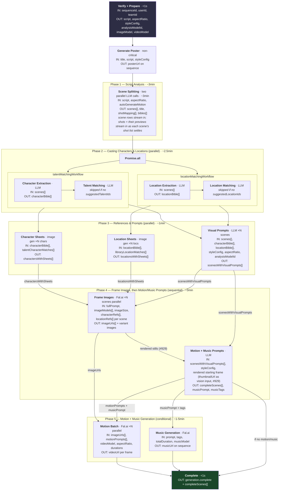
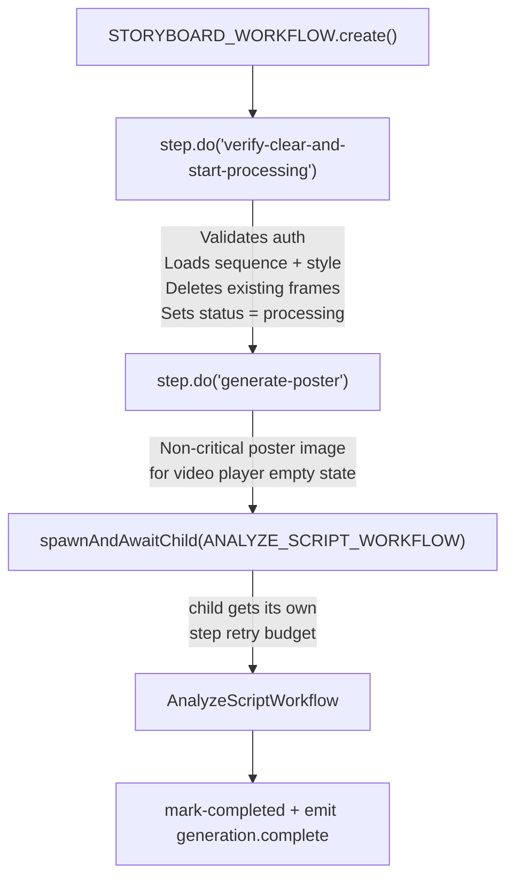
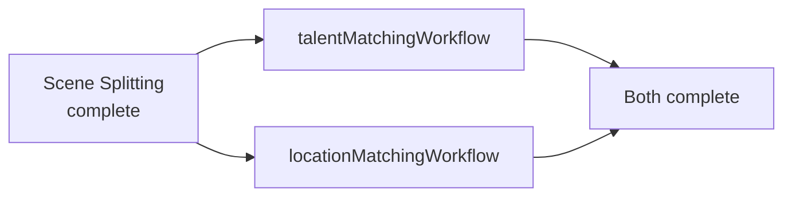
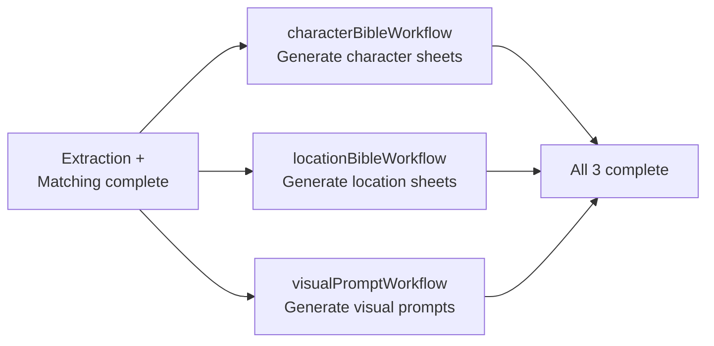
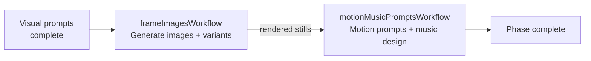
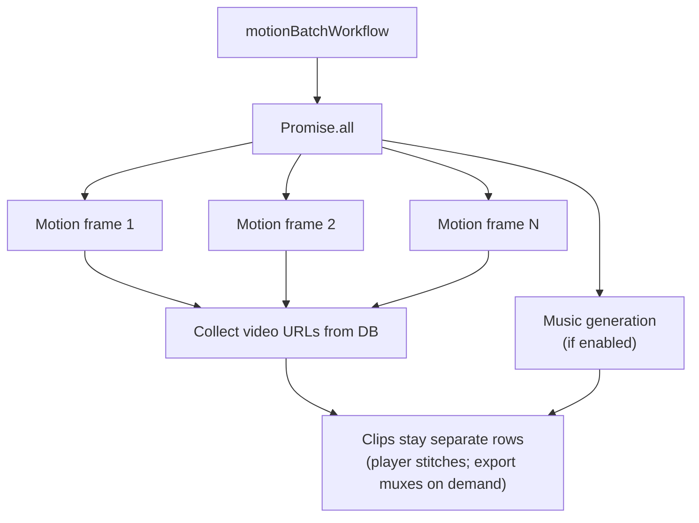
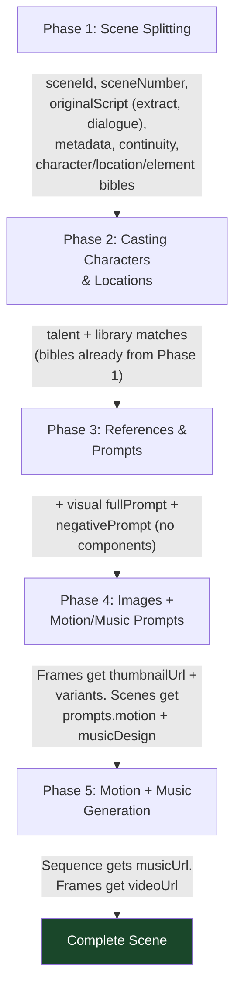

End-to-end pipeline that transforms a user's script into a complete storyboard with images, motion video, and music. For what an edit makes stale afterwards, use the interactive [Dependency graph](/docs/dependency-graph).

## High-Level Overview

> **Timing source:** Measured from local Cloudflare Workflows runs (Workerd via Miniflare) for a 9-scene run. As of #929, Phase 4 runs **sequentially** — frame images render first, then motion/music prompts — because the motion-prompt pass is conditioned on the actual rendered starting frame (passed to the LLM as a vision input). This trades the prior image∥prompt parallelism for image-grounded motion.

## Triggering Flow

The pipeline starts from server handlers in `src/sequences/sequences.fn.ts`:

1. **`createSequenceFn`** — Creates a new sequence record, then calls `triggerWorkflow('/storyboard', input)`
2. **`updateSequenceFn`** — If script, style, aspect ratio, or analysis model changed, triggers the same workflow
3. **`retryStoryboardFn`** — Retries a failed sequence (resets status to `processing`, re-triggers)

All three use `triggerWorkflow()` from `src/platform/server/workflow/client.ts`, which:

- Resolves the **Cloudflare Workflows binding** for the trigger path via `TRIGGER_TO_BINDING` (`src/platform/server/workflow/trigger-bindings.ts`) — e.g. `/storyboard` → `STORYBOARD_WORKFLOW`
- Calls `binding.create({ id, params: body })` to start a durable workflow instance in-process (Workerd locally, same runtime as production — no HTTP webhook, no QStash). `options.deduplicationId` becomes the instance id, making a trigger idempotent
- Returns the workflow instance id, persisted as `workflowRunId` on the relevant DB row for tracking

**Input shape (`StoryboardWorkflowInput`):**

| Field                  | Type      | Purpose                                      |
| ---------------------- | --------- | -------------------------------------------- |
| `userId`               | string    | Auth context                                 |
| `teamId`               | string    | Auth context                                 |
| `sequenceId`           | string    | Target sequence                              |
| `options`              | object    | `framesPerScene`, `generateThumbnails`, etc. |
| `autoGenerateMotion`   | boolean   | Whether to generate video for each frame     |
| `autoGenerateMusic`    | boolean   | Whether to generate music for the sequence   |
| `musicModel`           | string?   | Override music model                         |
| `imageModels`          | string[]? | Multiple image models for parallel gen       |
| `suggestedTalentIds`   | string[]? | Pre-selected talent for casting              |
| `suggestedLocationIds` | string[]? | Pre-selected locations for matching          |

## Storyboard Workflow

**File:** `src/sequences/server/workflows/storyboard-workflow.ts`

The storyboard workflow (`StoryboardWorkflow`, a `WorkflowEntrypoint` extending `OpenStoryWorkflowEntrypoint`) validates data, generates a poster image, then delegates to the analyze-script workflow. Each unit of work runs inside `step.do('name', …)` so the Workflows engine checkpoints and auto-retries it.

**Step: `verify-clear-and-start-processing`**

1. Validates auth via `validateSequenceAuth()`
2. Loads sequence with `getSequenceForUser()` — checks script and style exist
3. Loads and parses the style config
4. Deletes all existing frames for the sequence
5. Sets sequence status to `processing`
6. Returns resolved models: `analysisModelId`, `imageModel`, `videoModel`

**Step: `generate-poster`**

- Generates a poster image from the script+title+style for the video player empty state
- Non-critical — failures are logged and swallowed

**Steps: `upload-poster` → `save-poster`**

- `upload-poster` streams the provider image into R2 (`uploadPosterToStorage`) so the stored URL is the origin-relative `/r2/` path and never expires (#1117). Also non-critical: an upload failure falls back to the provider URL
- `save-poster` writes `posterUrl` on the sequence and emits `generation.poster:ready` with the URL

Then spawns the `AnalyzeScriptWorkflow` child via `spawnAndAwaitChild(ANALYZE_SCRIPT_WORKFLOW, …)` (`src/platform/server/workflow/await-child.ts`) and awaits its completion. The child runs as its own durable instance with its own per-step retry budget.

After the analyze-script workflow completes, marks status as `completed` and emits `generation.complete`.

## Analyze Script Workflow — Phase-by-Phase

**File:** `src/sequences/server/workflows/analyze-script-workflow.ts`

This is the core orchestration workflow. It runs durable units via `step.do()`, spawns child workflows via `spawnAndAwaitChild()`, and uses `Promise.all()` / `Promise.allSettled()` to fan child workflows out in parallel. It reads its input from `event.payload` and its instance id from `event.instanceId`.

### Phase 1: Scene Splitting (Streaming LLM)

**Sub-workflow:** `sceneSplitWorkflow` (`src/sequences/server/workflows/scene-split-workflow.ts`)

Uses streaming LLM output to create scene rows progressively as scenes arrive. Shots exist only once a scene's shot-list entry has landed (#1593); each shot then gets a preview image, copied into R2.

**Steps:**

Since #1035 the split runs as **two parallel LLM calls** (sibling `step.do`s via `Promise.all`), both over the same line-gutter copy of the script, and the LLM never re-emits script text. #1486 adds a third call after slices exist, so a scene can own 1..N shots; since #1585 that call also carries every spoken line, so `originalScript.dialogue` comes from it (the slice regex is only a streaming preview):

1. **`scene-splitting-stream`** — the scenes call, a **boundary-annotation** contract: the model returns `boundaries[] = { hintLine, quote }`, and `boundary-split.ts` resolves each verbatim quote to a raw offset (exact → normalized → fuzzy, monotonic cursor) and slices the ORIGINAL script — extracts are byte-verbatim adjacent substrings (`concat(slices) === script`, asserted). The stream is fed through `createStreamingSceneParser()`:
   - On each finalized boundary: persists the scene row + split script version, emits `generation.scene:new`. **No shot row** (#1593): the rail shows the scene as "listing shots…" until its shot-list entry lands
   - On title detection: updates the sequence title, emits `generation.updated`
   - Excessive anchor repairs → one retry with feedback; a second degraded result keeps the first-pass LLM scenes. Dropped boundaries are logged and emitted as a non-fatal `generation.error`
   - A cut inside one location/beat is **not** a new scene (the ONE SHOT RULE is gone)
2. **`scene-bibles`** — the bibles call: `{ characterBible[], locationBible[], elementBible[] }`. Location/element `firstMention` is `{ text, lineNumber }` on the wire; the owning scene id is derived server-side from the gutter line. A character entry carries `voiceOnly` (#1585): a narrator or off-screen voice gets a row but no sheet, no talent match, and no place in the still prompt. After the join, scene continuity tags are canonicalized onto bible tags (`tag-reconcile.ts`) since two independent calls can disagree.
3. **`scene-shot-list-1..K`** — lists 1..N structured shots inside each resolved slice. The scenes go out in **batches of `SHOT_LIST_BATCH_SCENES` (8)**, one `step.do` per batch, all batches concurrent (`Promise.all`): a feature-length paste is a dozen bounded calls, not one call at the model's output cap, and one failed batch replays alone. **Each call streams** (`runStructuredCall` + `onAccumulated`): the accumulated text is partial-parsed at most once per `PARSE_COALESCE_CHARS`, and every scene entry that has settled (`settledPrefix` — a later entry has started, or the stream ended) is landed on the spot via `persistSceneShots`: scene row upserted (stable id via `orderIndex`), its shots allocated (`attachSceneShots`) and upserted on `(sceneId, shotNumber)`, tail rows trimmed with `deleteFromShotNumber`, `generation.shot:created` emitted per shot, and a preview fired per shot — its spec text when the scene has 2+ shots, else the slice (fire-and-forget via `triggerWorkflow`, deduplicated per instance + shot, so a step replay is idempotent; the image workflow copies the preview into R2 and records it as a `kind: 'preview'` variant). Mid-stream entries match on `sceneNumber` only; the validated final payload is the authority — `attachShotLists` throws on an omitted scene and lands anything the stream did not (a positional match, a provider that sent no partial chunks). The credit deduction sums the batches. Each call (`shotListPassResultSchema`, union-free), each shot carrying the `dialogue` spoken in it, speakers spelled as the cast list spells them. **Length is per scene (#1593):** a scene's running time is its script label (`metadata.durationSeconds`, from `Scene N — Xs`) and its shots divide it. Enhance writes scenes only — it no longer labels shots or knows the video model's clip grid (#1621), so the shot-list pass is the only place shot count/durations are decided. The prompt gives each scene a `shots:` budget: `N to M` = at least one shot per longest clip, at most one per shortest (`minShotsForScene` / `maxShotsForScene`; `up to M` when the floor is 1, `exactly N` when floor equals cap). `allocateSceneShots` first splits any shot holding more speech than the longest clip can carry (`splitOverfullShots`, between lines, same setup), then spreads the label over the returned shots with `allocateClipDurations` on the model grid (a lone shot takes the whole label; a residual the grid cannot reach lands on the last shot) and clamps every shot to the model's longest clip — a pass that sends too few shots leaves the scene short, never ending on a 14-minute "clip". No film-wide target enters the run — `sequences.targetDurationSeconds` steers Enhance and the credit estimate only. `attachShotLists` rebuilds each scene's `originalScript.dialogue` from the shots with every line stamped `shotNumber`; `dialogueForShot` hands each clip only its own lines. Failure — no payload, or a scene the pass omits — fails the run: a one-shot fallback would silently leave scenes on the regex preview, which is empty for prose. `deriveShots` assembles visual/motion prompts from scene continuity + shot specs for **every clip of a 2+ shot scene** (#1517, see Phases 3–4); a 1-shot scene still takes the existing LLM prompt path, byte-identical. Stage 1 still renders **one video clip per shot** (no in-clip packing).
4. **`reconcile-shots`** / **`persist-scenes`** — reconcile stamps the title + workflow and assembles the result (`scenes`, `shotMapping` concatenated from the batches); persist-scenes is the replay-safe re-upsert of the final scene set + shot links (idempotent on `(sceneId, shotNumber)`), trimming orphan tail rows if a re-analyze produced fewer scenes.
5. **`deduct-llm-credits-scene-splitting`** / **`deduct-llm-credits-scene-bibles`** / **`deduct-llm-credits-scene-shot-list`** — one credit deduction per LLM call

- **Prompts:** `phase/scene-splitting-boundaries-chat` + `phase/scene-bibles-chat` + `phase/scene-shot-list-chat`
- **Variables:** `{ aspectRatio, script, elements }` (script is sanitized and line-guttered); shot-list gets `{ scenes, style, characters }` (formatted slices with their `duration:` + `shots:` budget lines, director style, the cast list with voice-only entries marked)
- **Response schemas:** `sceneSplitScenesResultSchema` + `sceneSplitBiblesResultSchema` + `shotListPassResultSchema` — all under the ~3KB Anthropic strict-output grammar budget enforced by `response-schema-budget.test.ts`
- **Output:** `{ scenes[], title, shotMapping[], characterBible[], locationBible[], elementBible[] }` — `shotMapping` maps each analysis shot (`analysisSceneId` + `shotNumber`) to `shotId/frameId` used throughout remaining phases. A 1-shot scene still has exactly one mapping row.

### Phase 2: Casting Characters & Locations (Parallel Sub-Workflows)

After scene splitting, two child workflows run **in parallel** via `Promise.all` over `spawnAndAwaitChild(...)`:

**Talent Matching Workflow** (`src/cast/server/workflows/talent-matching-workflow.ts`):

Bibles already exist from Phase 1. This workflow only matches.

1. Uses `input.characterBible` from scene-split (no character-extraction LLM), minus voice-only entries (#1585): a narrator has no face to cast, so it is never offered to the matcher, and `build-matches` drops any match that names one
2. **Talent matching** (skipped if no `suggestedTalentIds`):
   - Loads talent records from DB by IDs
   - LLM matches characters to talent
   - Deduplicates matches (each talent/character used once), emits `generation.talent:matched`
3. **Returns:** `{ characterBible, matches: talentCharacterMatches }`

**Location Matching Workflow** (`src/cast/server/workflows/location-matching-workflow.ts`):

1. Uses `input.locationBible` from scene-split (no location-extraction LLM)
2. **Location matching** (skipped if no `suggestedLocationIds`):
   - Loads library locations from DB by IDs
   - LLM matches locations to library entries (requires confidence >= 0.5)
   - Deduplicates matches, emits `generation.location:matched`
3. **Returns:** `{ locationBible, matches: libraryLocationMatches }`

### Phase 3: References & Prompts (Parallel Sub-Workflows)

Three child workflows spawned in parallel via `Promise.all` over `spawnAndAwaitChild(...)`:

**Character Bible Workflow** (`src/cast/server/workflows/character-bible-workflow.ts`):

- Creates the `characters` DB rows (upsert on `(sequenceId, characterId)`; the Script stage already made them sheet-less)
- Generates a reference sheet image for each on-screen character (one `CharacterSheetWorkflow` child per character, in parallel); a failed child leaves that row `failed` and the sequence stays at Casting so Generate can retry the misses (`Generate 1 / 3 references`, #1727)
- A voice-only character (#1585) gets no child: its row is created `completed` with no sheet version, it is left out of the billed sheet count, and it never reaches the still prompt or the reference images. The motion prompt still sees it, for delivery
- Uses talent match images as reference when available
- Uploads sheets to R2 storage
- Makes a voice for each speaking character with voices on (one `CharacterVoiceWorkflow` child each, `src/cast/server/workflows/character-voice-workflow.ts`; also triggered by Generate on the character card). The provider is chosen when the child is triggered (`newVoiceProvider`, carried as `voiceProvider`): **ElevenLabs** runs one Voice Design call and saves the top preview as a voice; **Seed** (#1765) has an LLM write a three-part range script, then records `takes` range reads side by side (`seed-range-read-<n>`, one step each). Each read is transcribed and checked against the script (`recordCheckedTake`), cut into normal / quiet / loud clips, isolated and stored in R2 inside its own step, so only `{ url, path }` crosses. A read that fails the check is retried by its step, and a take that still fails is dropped. The voice is the first take that passed, and the run fails only when none do. Each take is billed as three ledger lines: Seed Audio, Scribe and isolation. See `docs/architecture/seed-voices.md`

**Location Bible Workflow** (`src/cast/server/workflows/location-bible-workflow.ts`):

- Inserts location records into DB from location bible
- Generates establishing-shot reference images for each location (parallel)
- Uses library location reference images when matched
- Uploads to R2 storage, updates DB

**Frame Prompt Batch Workflow** (`src/stills/server/workflows/frame-prompt-batch-workflow.ts`):

- Delegates to `FramePromptWorkflow` (`src/stills/server/workflows/frame-prompt-workflow.ts`) per **1-shot** scene (parallel via `spawnAndAwaitChild`)
- Each such scene gets an LLM call that generates `fullPrompt` and `negativePrompt`. Scene `continuity` is authored in Phase 1 and is not re-emitted here.
- **A 2+ shot scene is skipped here (#1517):** every one of its clips — the head included — gets its start-frame prompt assembled by `deriveShots` (scene context + the shot's framing / start state), which analyze-script writes to `frame_prompt_versions` in the `persist-derived-visual-prompts` step at the top of Phase 4 (`derivedShotForItem` in `shot-work-items.ts` is the one predicate; it is null on the 1-shot path). The head's assembled prompt also stands in as that scene's visual grounding for the music prompt. Its input hash is stamped over the **cast** character bible (`buildCastCharacterBible`), the same one the prompt children are handed — staleness verify reads the cast row out of D1, so stamping the raw pre-cast bible made every clip of every multi-shot scene read stale from birth (#1732).
- Merges results back into scene objects

### Phase 4: Frame Images, then Motion/Music Prompts (Sequential)

As of #929, frame images render **before** motion/music prompts (the two ran in parallel previously). The motion-prompt pass is conditioned on the actual rendered starting frame — the per-scene motion workflow reads the frame's `thumbnailUrl` and passes it to the LLM as a vision input — so the still must exist first. The motion prompt then describes movement that continues _that exact pose and composition_, instead of guessing a plausible start from scene text alone. Music has no image dependency but rides along with motion in the same child workflow, so it inherits the wait (an accepted latency cost on the non-critical music artifact).

**Shot Images Workflow** (`src/stills/server/workflows/shot-images-workflow.ts`):

1. Builds per-scene character and location reference maps
2. For each scene, generates images with each selected model in parallel (one `spawnAndAwaitChild` per scene × model, gathered with `Promise.allSettled`):
   - Spawns the `ImageWorkflow` child (binding `IMAGE_WORKFLOW`) per scene per model
   - After each image completes, fires the shot-grid variant generation via `triggerWorkflow('/variant-image', …)` (fire-and-forget; its progress is tracked on `frame.variantImageStatus`)
3. Returns `{ imageUrls }` — primary model's URL per scene. The primary still is persisted to `frame.thumbnailUrl`, which the motion-prompt pass reads next.

**Motion + Music Prompts Workflow** (`src/motion/server/workflows/motion-music-prompts-workflow.ts`):

1. **Snap durations** — Snaps scene durations to video model capabilities upfront so both motion prompts and music design see identical values
2. **Parallel generation** — Motion prompts and music design run simultaneously (parallel _within_ this child; the child itself runs after frame images):
   - `MotionPromptWorkflow` — fans out one `MotionPromptSceneWorkflow` child per scene. Each per-scene call (`motion-prompt-scene-workflow.ts`) loads the rendered starting frame and, when the chosen analysis model accepts image input, attaches it to the LLM as a vision input (#929). The image's input-hash is folded into `motionPromptInputHash`, so re-rendering the still re-stales the motion prompt. When no image exists (render failed) or the model is text-only, it falls back to the text-only path. **Only 1-shot scenes get a child (#1517):** every clip of a 2+ shot scene takes its motion prompt from `deriveShots` (action + the single camera move + sound cue; reference-only prefixes unique framing, not the full visual prompt — scene lighting/palette/look attach once at assemble) in the batch's `derive-extra-shot-motion-prompts` step, written to `shot_prompt_versions` with a `derived-shot-motion` input hash. Both derived writes emit the same `generation.shot:updated` the LLM children do. **The motion prompt is written from the shot's lines (#1784):** each child's payload carries `dialogue` — in the pipeline, the shot-list lines scene-split just seeded onto the shot's dialogue node, or on a continue the checkpoint's `dialogueLinesByShotId` (re-read from the node, so a line edited while stopped is what the prompt is written from); from a regenerate or Update Stale, the `shotDialogueResolver` answer at click time — and `sceneWithShotDialogue` puts those lines in place of the script's in both the LLM's `scene` variable and the stamped hash.
   - `MusicPromptWorkflow` — Single LLM call classifying per-scene music requirements + generating unified prompt with tags
3. **Merge** — Combines motion prompts and music design into `completeScenes[]`
4. **Returns:** `{ completeScenes, musicPrompt, musicTags }`

### Phase 4b: Dialogue Audio (Conditional)

**Sub-workflow:** `DialogueAudioWorkflow` (`src/motion/server/workflows/dialogue-audio-workflow.ts`), one `spawnAndAwaitChild` after images and before motion. Runs only for scenes whose speakers hold a `voiceId` (#1554) — an ElevenLabs voice, recorded by Text to Dialogue, or a `seed:` voice (#1765), recorded by Seed Audio (`recordSeedDialogueCall`, see `docs/architecture/seed-voices.md`); a line bound to an uploaded audio element or opted out to the video model is skipped. Scenes record concurrently. A scene that fails is logged and does not fail the stage: the scenes that recorded keep their clips, and the failed scene's shots have none, so motion records them itself (see "Motion's fallback") and fails just those shots with the reason.

**Record wide, keep narrow (#1657).** Text to Dialogue acts the turns it is given against each other, so a shot recorded alone is a cold read of a reply the model never heard: the call speaks the scene's whole conversation. What is kept is narrow, so one edit disturbs one shot — only shots whose working-set clip no longer matches their lines adopt the new audio; the rest keep the section they had and nothing of theirs goes stale (`recordDialogue`, `src/motion/server/record-dialogue.ts`):

- **The lines come from the shot**, not the script and not a scene list: `shot_dialogue_versions` holds them per shot (append-only, one selected row). The shot-list pass seeds a `prompt` row per shot at scene split; a prompt-editor edit appends `user-edit` for that one shot, so it cannot drop a concurrent edit to another; a shot with no row yet is derived from its scene's script by `deriveShotDialogueLines`. The conversation is assembled at use — shot order, then line order within the shot (`sceneConversation`) — so a shot reorder needs nothing restamped. The lines are snapshotted onto the run (`GenerationCheckpoint.dialogueLinesByShotId`) and re-read from D1 at a continue (`refreshCheckpointFromCast`), so an edit made while the run was stopped is what gets recorded.
- **Who adopts.** Per scene, the prepare step reads the shots through the existing hatch `scopedDb.liveRead.shots.getByIds` and asks `matchingDialogueClips` which voiced shots hold no clip for their lines — those are `adoptShotIds`. None → the scene is reused and no call is made.
- **One index.** A turn's `index` is **shot-relative**, which is what lets every #1554/#1651 helper (`dialogueClipSourceKey`, `matchingDialogueClips`, `spokenLinesFor`, `withSpokenText`, the rewrite merge) work unchanged on one shot's lines. A turn's place in the conversation is its array position, never stored.
- **Chunking.** A conversation over `DIALOGUE_TAKE_CHUNK_CHARS` (2000 characters of `ttsUtterance` text, ElevenLabs' reliability line for v3) is split at a **shot boundary**, never inside a shot (`chunkTakeLines`). Each chunk is its own recording — nothing is joined — and only chunks that contain an adopting shot are recorded. A chunk also breaks where the voice provider changes (a Seed voice and an ElevenLabs voice never share a call), and a Seed chunk where a fourth speaker would join (Seed takes one voice clip per speaker, three at most) or past 1,000 line characters.
- **Bytes never cross a step (#1645).** `recordDialogueCall` decodes the response, measures each shot's window, uploads the WHOLE WAV once inside its `step.do`, and returns only `{ recordingId, storageKey, url, durationSeconds, characterCount, turns, windows, charges }` (`charges`: one ledger line per provider, so a Seed call's Scribe pass is billed as ElevenLabs spend). `recordSeedDialogueCall` returns the same record. There is no read-back or assemble step.
- **Section boundaries.** The silence between two turns belongs to the shot that is about to speak, so a window starts where the previous shot stopped speaking and runs to the next shot's first word (`shotSliceWindows`). Its tail is measured **once, here** (`trimmedEndSeconds`, in place, no copy) and stored as the section's `toSeconds`.
- **The cut is a cache.** One `step.do` per adopting shot calls `cutAudioSection` (`src/motion/server/cut-audio-section.ts`), which never loads the recording: a 4 KiB ranged read parses the WAV header, the body is a ranged R2 stream (`readStorageStream`), padding to the provider floor is appended as zeros, and the whole is a `FixedLengthStream` because `r2.put` rejects an unknown length. The key is deterministic (`<recordingId>_<fromMs>_<toMs>_<minMs>.wav`), so an existing file is returned as-is and a replay costs nothing.
- **A packed clip sends one longer section (#1794).** Neighbouring sections can overlap: a section ends on its last loud sample, and the next starts at the previous shot's last word as the transcript timed it. Sent side by side, a multi-shot clip would play the overlap twice and count it twice against the model's combined audio cap (H3 Max: 15s). So `MotionWorkflow` joins consecutive member clips from one recording in a `cut-spanning-section` step (`cutSpanningSection`): one longer section of the recording, from the first member's start to the last member's end, never longer than the recording. It reads each section by the clip id on the payload through `scopedDb.claims.shotDialogue.getSectionById`. Only the audio on the wire changes; each member keeps its own clip, and the manifest still names each member's clip ids.
- **Persistence.** One persist step: `scopedDb.shotDialogue.appendRecording(...)` per recorded chunk writes the `dialogue_recordings` row and a `shot_dialogue_sections` row for EVERY shot the call spoke — selected with `source: 'recorded'` for the adopting shots, unselected with `source: 'context'` for the rest — then `shots.setAudioClips(shotId, [clip])` for the adopted shots only. Ids are generated inside the step and both inserts are `onConflictDoNothing`, so a replay is idempotent. The clip's `id` is the section's id and it stamps `recordingId`. Picking another reading — older, or a context one — is the same `selectSection` (`selectShotDialogueSectionFn`), which re-cuts and puts that clip back on the one shot.
- **What a shot says.** Every trigger resolves a shot's lines through `shotDialogueResolver` (selected `shot_dialogue_versions` row → a pre-#1657 prompt row's copy → the script) and puts THAT into the payload's `motionPrompt.dialogue` and `voicedLines` (and, for a motion-prompt run, `dialogue`) — never the prompt row's own copy, and never the motion-prompt LLM's `dialogue` output. A run cannot read the node: the storyboard batch resolves from `dialogueLinesByShotId` on its payload, and Update Stale snapshots `dialogue` and `dialogueContext` on each plan target at click time. The render stamps `dialogueKey` on the clip manifest — every line its prompt quoted, on an audio-capable model — so an edit to any line, voiced or not, re-stales the clip.
- **On demand.** `regenerateShotDialogueFn` ("Regenerate dialogue" in a shot's readings list) triggers `DialogueAudioWorkflow` directly with one scene job whose `forceAdoptShotIds` names the shot, so it adopts a new reading even though its clip still matches. The run owns its reservation.
- **Once per scene, outside the pipeline too.** `MotionBatchWorkflow` (`recordScenesOnce`) and `UpdateStaleShotsWorkflow` spawn `DialogueAudioWorkflow` over `dialogueRecording.scenes` from their payload/plan BEFORE fanning out, then hand each child its clip (`attachRecordedClips`) — or, in Update Stale, let `prepare-video` read it live. Update Stale gates it on balance first (`gate-dialogue-audio`) and skips it when short. Update Stale reports it per target (`dialogueTargetOutcome`, #1740): a target with audio counts in `dialogues`; a dialogue-only target without it is a `dialogue` failure; a target with a video render records itself at `prepare-video` instead.
- **Claims.** `recordDialogue` opens with a `claim` step (`shot_dialogue_claims`), records only for the shots it claimed, promotes through `appendRecording` (pointer + `shots.audioClips` + claim completion in one guarded transaction), and runs `fail-claims` before rethrowing. It returns clips for PROMOTED shots only.
- **Motion's fallback.** A shot whose clip is missing or no longer matches gets `dialogueContext` on its `MotionWorkflowInput` at the trigger (`contextWindow`: its own turns plus whole neighbouring shots, grown outward under the chunk limit). `MotionWorkflow` hands that to the same `recordDialogue` with `adoptShotIds: [shotId]` — it records the window and keeps only its own shot.

**Fitting the section to the clip (#1651).** ElevenLabs v3 takes no target or maximum duration, so the length is discovered rather than requested. The ladder checks **only the adopting shots**: a section whose padded length is over its shot's limit sends THAT shot's turns to the rewrite (`shortenDialogueLines`, `src/motion/server/fit-dialogue-clip.ts`) and the chunk is re-recorded, because the other shots' delivery is not independent of it. Only the final attempt's recordings get rows:

1. `convertWithTimestamps` (not `convert`) returns the recording plus per-turn voice segments (the character alignment is never read). `trimmedEndSeconds` pulls the section's end back to whichever is LATER of the last audible sample and the end of the shot's last voice segment — so a segment that under-reports cannot clip a word, and a noise floor that never dips cannot keep a tail the segment says is silent. It measures in place and moves a number, not bytes; the pad up to the provider floor is added later, at cut time.
2. Still over: an LLM (`phase/shorten-dialogue-chat`) tightens the turns to the shot's word budget (`DIALOGUE_WORDS_PER_SECOND`, ~30 words for 15s) and the chunk is re-recorded. Bounded by `MAX_DIALOGUE_FIT_ATTEMPTS` (2), each pass billing another TTS call. The rewrite is merged **by turn index**, so a model that drops or invents a turn cannot change who speaks or with whose voice — the worst it does is leave a line as it was, which stops the loop.
3. Still over: the shot fails here with the measured numbers. It is never submitted — a provider that refuses a 15.4s reference reports it as an opaque request error minutes later, on a render the user paid for.

There is deliberately **no time-compression** rung: speeding speech up alters the performance the user cast, and a pitch-preserving stretch in workerd would be ours to write and tune.

**Two budgets, from `dialogueFitBudget`.** `limitSeconds` is the refusal line — `dialogueAudioMaxSeconds(videoModels)` (the tightest of each model's reference-audio window and its longest grid clip) minus `DIALOGUE_FIT_SLACK_SECONDS` (0.2), which is where H3 Max's 14.8s comes from; the slack covers trailing silence, encoder padding and provider rounding, none of which the end of the shot's last voice segment measures. `targetSeconds` is what a rewrite aims at: the **shot's own** length when shorter, so the reading fits the cut instead of stretching it. Speech between the two is kept rather than rewritten — `raiseShotDurationToCoverAudio` extends the clip, a pacing cost, not a broken render.

**The delivered wording, not the authored wording, drives the prompt.** A rewritten reading records its per-turn text on the section and its clip as `spokenLines` (and on the recording's turn as `spokenText`); `sourceKey` still keys the lines as authored, so matching, staleness and the manifest's `audioSourceKey` do not move and nothing re-records. `MotionWorkflow` reads it back with `withSpokenText` before assembling, because the prompt's dialogue drives lip movement and has to say what the bound audio says. The user's script in `frame.metadata` is left as they wrote it.

The shot-list pass is the prevention half: its Dialogue rules give each shot a words-per-second placement budget and tell it to spread a long conversation across more shots rather than stacking it onto one short one. The prompt is advice the model can ignore, so `allocateSceneShots` enforces it (`splitOverfullShots`): a shot holding more words than the longest clip's budget is split between lines into back-to-back shots on the same setup. A single line is never cut.

### Phase 5: Motion + Music Generation (Conditional)

**Sub-workflow:** `motionBatchWorkflow` (`src/motion/server/workflows/motion-batch-workflow.ts`)

Only runs if `autoGenerateMotion` is enabled, a video model is set, and images were generated. A single orchestrator handles:

1. **Parallel generation** — All frame motion child workflows + the optional music workflow spawned simultaneously (`spawnAndAwaitChild` under `Promise.all`)
2. **Collect video URLs** — Reads from DB (authoritative ordering by `orderIndex`)

**Ark draft mode (#1756).** With `sequences.draftMotion` on, every motion payload carries `draft: true` and a Seedance 2.5 clip on the BytePlus via renders at 480p with Ark's `draft` flag; `MotionWorkflow` stamps the Ark task id on the version (`stamp-draft-task`). "Render at quality" (`renderShotAtQualityFn` / `renderSequenceDraftsAtQualityFn` → `renderDraftAtQuality`) triggers `/motion` directly with `finalFromDraft: { taskId, renderSegmentId, manifest }` and its own reservation: the run opens a 1080p version on the draft's segment with the draft's manifest, skips dialogue (by omission: the payload carries no `voicedLines`, so never snapshot them onto a final), ingest and the content rescue, submits only the task id (`submitBytePlusFinalRender`), and promotes it like any primary render. A content refusal on a final is terminal after one poll (same seed, same assets) and a draft never swaps to the Grok fallback (the user picks another model). One run per segment, and one hold plus one instance per (draft, attempt): the reservation `idempotencyKey` and the trigger `deduplicationId` are both `motion-final-<versionId>-<sibling count>`. The id expires seven days after the draft. `StudioGenerationWorkflow` has the same `finalFromDraftTaskId` shape: `renderStudioAssetAtQuality` opens a NEW studio row from the draft's input at 1080p and the run skips ingest and stamps no `draftTaskId`. `MotionBatchWorkflow`'s Ark pool admission budgets `arkStillsToRegister` (start frames and person sheets — what ingest actually creates), not every reference URL. See `docs/architecture/byteplus-ark.md`.

There is no merge step: the clips stay separate rows. The player stitches them client-side (`src/motion/ui/packed-playback.ts`), and a single MP4 is produced only on demand by `POST /api/v1/sequences/$id/exports` → `SequenceExportWorkflow` → the video-export Container (production-only).

### Final: Return

Returns the `completeScenes` array.

## Data Flow: Scene Object Accumulation

Each phase enriches the `Scene` object. The frame's `metadata` column is updated after visual prompts to persist intermediate results. Phase 1 creates frames progressively during streaming and triggers preview images for instant feedback.

**Scene type fields** (from `src/shots/scene-analysis.schema.ts`):

| Field            | Added By | Notes                                                                      |
| ---------------- | -------- | -------------------------------------------------------------------------- |
| `sceneId`        | Phase 1  | Required, unique                                                           |
| `sceneNumber`    | Phase 1  | Required, 1-indexed                                                        |
| `originalScript` | Phase 1  | `{ extract, dialogue }`                                                    |
| `metadata`       | Phase 1  | `{ title, durationSeconds, location, timeOfDay, storyBeat }`               |
| `continuity`     | Phase 1  | `{ characterTags, environmentTag, colorPalette, lightingSetup, styleTag }` |
| `prompts.visual` | Phase 3  | `{ fullPrompt, negativePrompt }` — `components` is no longer LLM output    |
| `prompts.motion` | Phase 4  | `{ fullPrompt }` — `components`/`parameters` are no longer LLM output      |
| `musicDesign`    | Phase 4  | `{ presence, style, mood, atmosphere }`                                    |
| `sourceImageUrl` | Optional | URL of generated or uploaded source image                                  |

## Real-Time Events

Events emitted on a per-sequence realtime channel (`getGenerationChannel(sequenceId)`, a `RealtimeChannel` Durable Object). Every emit is persisted for history replay, so payloads carry ids and small strings only; a `/history` replay is bounded by rows and bytes (#1811).

Realtime requires the `enable_request_signal` compatibility flag in
`wrangler.jsonc` (inherited by production and test). `/api/realtime` listens
for request cancellation to clear its heartbeat, release the write queue,
and abort its upstream Durable Object subscriptions. Cloudflare does not
enable this signal by compatibility date alone. Without the flag, closed
browser connections can retain subscribers and timers indefinitely, even
with bounded queues and history. Node stream mocks do not exercise this
runtime behavior: verify disconnect cleanup over real HTTP in Workerd.
See [Cloudflare's request cancellation documentation](https://developers.cloudflare.com/changelog/post/2025-05-22-handle-request-cancellation/).

| Event                                 | When Emitted                                       | Payload                                                               |
| ------------------------------------- | -------------------------------------------------- | --------------------------------------------------------------------- |
| `generation.phase:start`              | Before each LLM call or generation phase           | `{ phase, phaseName }`                                                |
| `generation.phase:complete`           | After each phase completes                         | `{ phase }`                                                           |
| `generation.poster:ready`             | Storyboard workflow — after poster generated       | `{ posterUrl }`                                                       |
| `generation.scene:new`                | Phase 1 — progressively as scenes stream in        | `{ sceneId, sceneNumber, title, scriptExtract, durationSeconds }`     |
| `generation.scene:updated`            | Phase 1 — as scene metadata updates during stream  | `{ sceneId, sceneNumber, title, scriptExtract, durationSeconds }`     |
| `generation.updated`                  | Phase 1 — after title detected in stream           | `{ title }`                                                           |
| `generation.shot:created`             | Phase 1 — progressively as shots are upserted      | `{ shotId, sceneId, orderIndex }`                                     |
| `generation.shot:updated`             | After a prompt version or dialogue clip is written | `{ shotId, updateType }` (ids only; the client refetches, #1811)      |
| `generation.talent:matched`           | Phase 2 — when talent matched to characters        | `{ matches: [{ characterId, characterName, talentId, talentName }] }` |
| `generation.talent:unmatched`         | Phase 2 — unused talent after matching             | `{ unusedTalentIds, unusedTalentNames }`                              |
| `generation.location:matched`         | Phase 2 — when locations matched to library        | `{ matches: [{ locationId, locationName, libraryLocationId, ... }] }` |
| `generation.image:progress`           | Image workflow — generating/completed/failed       | `{ frameId, status, thumbnailUrl? }`                                  |
| `generation.variant-image:progress`   | Variant workflow — generating/completed/failed     | `{ frameId, status, variantImageUrl? }`                               |
| `generation.video:progress`           | Motion workflow — generating/completed/failed      | `{ frameId, status, videoUrl? }`                                      |
| `generation.audio:progress`           | Music workflow — generating/completed/failed       | `{ status, audioUrl? }`                                               |
| `generation.character-sheet:progress` | Character bible — per character                    | `{ characterId, status, sheetImageUrl? }`                             |
| `generation.location-sheet:progress`  | Location bible — per location                      | `{ locationId, status, referenceImageUrl? }`                          |
| `generation.recast:start`             | Recast character — before regenerating frames      | `{ characterId, frameCount }`                                         |
| `generation.recast:complete`          | Recast character — all frames regenerated          | `{ characterId, successCount, failedCount }`                          |
| `generation.recast:failed`            | Recast character — on failure                      | `{ characterId, error }`                                              |
| `generation.recast-location:start`    | Recast location — before regenerating frames       | `{ locationId, frameCount }`                                          |
| `generation.recast-location:complete` | Recast location — all frames regenerated           | `{ locationId, successCount, failedCount }`                           |
| `generation.recast-location:failed`   | Recast location — on failure                       | `{ locationId, error }`                                               |
| `generation.error`                    | On non-fatal workflow error                        | `{ message, phase? }`                                                 |
| `generation.failed`                   | On workflow failure                                | `{ message }`                                                         |
| `generation.complete`                 | Storyboard workflow — after everything finishes    | `{ sequenceId }`                                                      |

## Error Handling

### Failure Handling (`onFailure`)

Every workflow extends `OpenStoryWorkflowEntrypoint` (`src/platform/server/workflow/base-workflow.ts`), which wraps the workflow body: when `runImpl` throws, the base class builds a `ScopedDb` from the payload and invokes the subclass-supplied `onFailure({ event, error, scopedDb })`. The analyze-script `onFailure`:

1. Sanitizes the error via `sanitizeFailResponse()` — extracts inner errors from nested failure wrappers, maps known Cloudflare error codes (e.g., `1102` → "Worker exceeded memory limit"), and truncates messages over 500 characters
2. Updates sequence status to `'failed'` with the error message
3. Emits `generation.failed` with the sanitized error

> The base class deliberately skips `onFailure` when the engine aborts mid-run (a transient state the instance resumes from), so it doesn't mark user-facing rows failed for a retry that will succeed.

Child workflows (image, motion, music, character bible, location bible, talent matching, location matching, frame-images, motion-batch) each implement their own `onFailure` that updates the relevant record's status to `'failed'`.

**BytePlus ACR leases (#1361, #1531).** `MotionWorkflow` and `StudioGenerationWorkflow` lease every still they register on Ark under an owner of `motion:<instanceId>` / `studio:<instanceId>` (`assetLeaseOwner`). Both release by that owner on success (step `release-byteplus-asset-leases`, whichever via the clip finally rendered on; a release that exhausts its retries is logged, never fails the rendered clip) and at the end of `onFailure` (inside the base class's retried `emit-failure` step), via `scopedDb.bytePlusAssets.releaseOwner`. That drops the run's own leases and any reservation it never finalized; another run's lease on the same still is untouched. A batch parent never releases for its children. Every claim and finalize renews all of the run's leases, so a still leased early cannot expire while a later still waits. A miss is a `byteplus_assets` row with NULL `assetId` (counts against capacity); another run for that still gets `pending` and the claim step retries. A full leased pool is `NonRetryableError` — it does not wait out the TTL. Abandoned reservations are takeable after the 45-minute TTL. Ingest per still is `-url` (fal key + fetchable URL) → `-claim` (the only retried-for-minutes step) → `-evict` (an already-deleted asset counts as done) → `-slot` → `-wait` → `-create`. Motion's parents (motion-batch, update-stale-shots) await a motion child for 90 minutes, and analyze-script awaits motion-batch for 120.

**Content soften and refused audio (#1373, #1773).** After the reseeds, the rescue attempt of a single-shot clip softens only `motionPrompt.fullPrompt` (the prose) — never the assembled prompt — and re-assembles the retry with `assembleMotionPrompt`, so the dialogue block, audio trailer and scene header are re-added, not rewritten. The `softened` version stores that prose with the version's `audio`; dialogue stays on the shot's dialogue node. A packed multi-shot clip still softens its assembled prompt. When the clip was sent reference audio (a dialogue reading or an audio element) and the rejection names the input audio (`flaggedInputs(...).inputAudio`: a `body.audio…` field, Ark's `InputAudioSensitiveContentDetected`, or a message naming the input/reference audio), the rescue is skipped — no soften, no model fallback — and the terminal message names the recording and says what to change.

**Prompt-length recovery (#1754).** `MotionWorkflow` never truncates a prompt. When a via that documents a hard ceiling refuses one — our own `PromptTooLongError` thrown before the request, or the provider's 422, both classified by `isPromptTooLongError` — the submit step returns a `tooLong` sentinel instead of throwing. That sentinel does **not** join the content-rejection reseed ladder (reseeding the same prompt cannot shorten it): the loop calls `shortenOverlongMotionPrompt` once under `videoPromptHardLimit(model)`, appends the rewrite as a `shortened` shot prompt version (selected on a primary render, history-only on a variant, and the in-flight clip's manifest is repointed at it via `writeRescuedMotionPrompt` — the same helper the #1373 content soften uses), and resubmits. One rewrite per run; a second refusal is a `NonRetryableError` naming both numbers, because a shot that still will not fit is the user's to shorten.

### Retry Strategy

Under Cloudflare Workflows, retries are configured per `step.do()` (and on the workflow class), not on the trigger — the legacy `retries`/`retryDelay` options on `triggerWorkflow()` are accepted for back-compat but are **no-ops**.

| Level                                      | Retries         | Backoff                                                                         |
| ------------------------------------------ | --------------- | ------------------------------------------------------------------------------- |
| Individual `step.do()` steps               | engine default  | Managed by the Workflows engine                                                 |
| LLM-call steps (`durableLLMCallCf`)        | via `step.do`   | Engine-managed                                                                  |
| Child workflows (`spawnAndAwaitChild`)     | own step budget | Awaited with a `timeout`; the child retries its own steps                       |
| Ark still claim (`<prefix>-ark-<n>-claim`) | 40 × 30s        | Constant — waits out another run's create; a full leased pool fails immediately |

Per-scene fan-out (image, variant, motion) uses `Promise.allSettled` over `spawnAndAwaitChild`, so one scene's failure or timeout doesn't kill the rest of the batch — failures are collected and surfaced as a single error. Dialogue audio is the exception: its failed scenes are logged, not raised, because motion records those shots again (Phase 4b).

### Cloudflare Workflows Durability

- Each `step.do()` step is checkpointed by the Workflows engine. The workflow body **replays from the top** on every step callback; already-completed steps return their persisted result instead of re-executing, so on failure or restart execution effectively resumes from the last completed step. (This is why steps must be idempotent and why large blobs shouldn't be returned across a step boundary.)
- `spawnAndAwaitChild()` starts a child workflow instance (its own `binding.create()`) and awaits its result via a wake event (`waitForEvent`). The child is durable independently of the parent.
- No application-level concurrency gating — fal queues submissions server-side (`IN_QUEUE` doesn't count toward the cap, jobs are never rejected), and OpenRouter handles its own rate limits. (A past QStash-era attempt at gating via `flowControl` produced ghost slot leaks on cancel and PR-preview cross-contamination; see #725. Cloudflare Workflows likewise has no app-level gate.)

## Key Files Reference

| File                                                           | Purpose                                                              |
| -------------------------------------------------------------- | -------------------------------------------------------------------- |
| `src/sequences/sequences.fn.ts`                                | Server functions that trigger the pipeline                           |
| `src/platform/server/workflow/client.ts`                       | `triggerWorkflow()` — resolves binding + `binding.create()`          |
| `src/platform/server/workflow/trigger-bindings.ts`             | `TRIGGER_TO_BINDING` — maps trigger path → Workflows binding         |
| `src/platform/server/workflow/base-workflow.ts`                | `OpenStoryWorkflowEntrypoint` — base class, `onFailure`, `ScopedDb`  |
| `src/platform/server/workflow/await-child.ts`                  | `spawnAndAwaitChild()` — parent→child fan-out + await                |
| `src/motion/server/render-at-quality.ts`                       | Ark draft → 1080p final: opens the run with `finalFromDraft` (#1756) |
| `src/models/server/byteplus-final-render.ts`                   | Posts the `draft_task` body Ark renders the final from               |
| `src/models/server/llm-call-helper.ts`                         | `durableLLMCallCf` / `durableStreamingLLMCallCf`                     |
| `src/sequences/server/workflows/storyboard-workflow.ts`        | Wrapper: verify, clear, poster, spawn analyze-script                 |
| `src/sequences/server/workflows/analyze-script-workflow.ts`    | Core orchestration (phases 1-5)                                      |
| `src/sequences/server/workflows/scene-split-workflow.ts`       | Phase 1: scenes + bibles in parallel, then streamed shot lists       |
| `src/sequences/boundary-split.ts`                              | Anchor resolution + verbatim script slicing                          |
| `src/sequences/tag-reconcile.ts`                               | Canonicalize scene continuity tags onto bible tags after the join    |
| `src/sequences/server/streaming-scene-parser.ts`               | Incremental JSON parser for the boundary-annotation stream           |
| `src/platform/server/workflow/sanitize-fail-response.ts`       | Error message extraction + Cloudflare error-code mapping             |
| `src/shots/server/db/frames.ts`                                | Scoped-db frame methods (`createFramesMethods`)                      |
| **Extraction + Matching**                                      |                                                                      |
| `src/cast/server/workflows/talent-matching-workflow.ts`        | Talent matching against Phase 1 character bible                      |
| `src/cast/server/workflows/location-matching-workflow.ts`      | Location matching against Phase 1 location bible                     |
| **Reference Generation**                                       |                                                                      |
| `src/cast/server/workflows/character-bible-workflow.ts`        | Character sheet generation (parallel per character)                  |
| `src/cast/server/workflows/character-sheet-workflow.ts`        | Single character sheet image generation                              |
| `src/cast/server/workflows/location-bible-workflow.ts`         | Location sheet generation (parallel per location)                    |
| `src/cast/server/workflows/location-sheet-workflow.ts`         | Single location reference image generation                           |
| **Prompt Generation**                                          |                                                                      |
| `src/stills/server/workflows/frame-prompt-batch-workflow.ts`   | Visual prompt sub-workflow (parallel per 1-shot scene)               |
| `src/stills/server/workflows/frame-prompt-workflow.ts`         | Per-scene visual prompt LLM call                                     |
| `src/motion/server/workflows/motion-prompt-workflow.ts`        | Motion prompt sub-workflow (parallel per scene)                      |
| `src/motion/server/workflows/motion-prompt-batch-workflow.ts`  | Motion prompts per shot batch; stamps the derived-shot motion hash   |
| `src/motion/server/workflows/motion-music-prompts-workflow.ts` | Orchestrates motion + music prompts in parallel                      |
| `src/audio/server/workflows/music-prompt-workflow.ts`          | Music design LLM call                                                |
| **Image Generation**                                           |                                                                      |
| `src/stills/server/workflows/shot-images-workflow.ts`          | Orchestrates image + variant gen for all scenes                      |
| `src/stills/server/workflows/image-workflow.ts`                | Single image generation (Fal.ai)                                     |
| `src/stills/server/workflows/shot-variant-workflow.ts`         | Shot grid variant generation                                         |
| **Motion + Music Generation**                                  |                                                                      |
| `src/motion/server/workflows/motion-batch-workflow.ts`         | Orchestrates motion + music generation                               |
| `src/motion/server/workflows/motion-workflow.ts`               | Single motion/video generation (Fal.ai)                              |
| `src/audio/server/workflows/music-workflow.ts`                 | Music generation (Fal.ai)                                            |
| `src/sequences/server/workflows/sequence-export-workflow.ts`   | Server-side export (video-export Container; production-only)         |
| **Recasting + Regeneration**                                   |                                                                      |
| `src/cast/server/workflows/recast-character-workflow.ts`       | Recast a character and regenerate affected frames                    |
| `src/cast/server/workflows/recast-location-workflow.ts`        | Recast a location and regenerate affected frames                     |
| `src/shots/server/workflows/regenerate-shots-workflow.ts`      | Regenerate specific shots with new prompts                           |
| **Schemas + Events**                                           |                                                                      |
| `src/platform/realtime/index.ts`                               | Real-time event schema and channel helpers                           |
| `src/shots/scene-analysis.schema.ts`                           | `Scene` type definition                                              |
| `src/sequences/response-schemas.ts`                            | `musicDesignResultSchema` and other LLM response schemas             |
